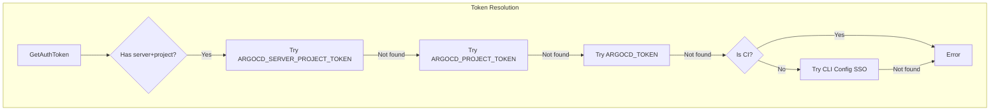

# ArgoCD Token Per Server Implementation

## Context

Currently, ArgoCD authentication uses:

- `ARGOCD_<PROJECT>_TOKEN` (project-specific)
- `ARGOCD_TOKEN` (fallback)

With 2 ArgoCD servers (tooling and pci), we need server-aware token resolution.

## New Token Resolution Priority

```
1. ARGOCD_<SERVER>_<PROJECT>_TOKEN  (new, most specific)
2. ARGOCD_<PROJECT>_TOKEN           (legacy, project-specific)
3. ARGOCD_TOKEN                     (legacy, global fallback - keep for migration period)
4. ArgoCD CLI config (SSO)          (local only)
```

Where `<SERVER>` is derived from the ArgoCD server address:

- `argocd.services.tooling.cloudwalk.network` -> `TOOLING`
- `argocd.services.pci.cloudwalk.network` -> `PCI`

## Architecture



## Changes Required

### 1. Config Schema Update

Add optional `tokenEnvVar` field to ArgoCD config in [internal/config_manager/config.go](internal/config_manager/config.go):

```go
type ArgoCD struct {
    Project            string `yaml:"project"`
    ProjectAlternative string `yaml:"projectAlternative,omitempty"`
    Namespace          string `yaml:"namespace,omitempty"`
    Cluster            string `yaml:"cluster,omitempty"`
    Server             string `yaml:"server,omitempty"`
    TokenEnvVar        string `yaml:"tokenEnvVar,omitempty"` // NEW: override token env var
}
```

### 2. Token Resolution Logic

Update [internal/argocd/auth.go](internal/argocd/auth.go):

- Add `extractServerName(serverAddr string) string` function to derive server identifier
- Modify `GetAuthToken` and `GetTokenFromEnvWithInfo` to use new priority order
- Add `getServerTokenEnvVar(server, project string) string` helper

Key logic for server name extraction:

```go
// argocd.services.tooling.cloudwalk.network -> TOOLING
// argocd.services.pci.cloudwalk.network -> PCI
func extractServerName(serverAddr string) string {
    // Parse: argocd.services.<name>.cloudwalk.network
    parts := strings.Split(serverAddr, ".")
    if len(parts) >= 3 && parts[0] == "argocd" && parts[1] == "services" {
        return strings.ToUpper(parts[2])
    }
    return ""
}
```

### 3. Template Function Update

Update [internal/template/funcs.go](internal/template/funcs.go):

- Add `argoCDServerTokenEnvVarFunc(server, project string) string` function
- Keep existing `argoCDTokenEnvVarFunc` for backward compatibility

### 4. Workflow Template Update

Update [internal/generate/templates/workflows/skeleton/.github/workflows/release.yaml.tpl](internal/generate/templates/workflows/skeleton/.github/workflows/release.yaml.tpl):

```yaml
- name: Deploy to staging
  env:
    # New format: server + project
    ? {
        {
          argoCDServerTokenEnvVar .Metadata.config.context.argocd.server .Metadata.config.context.argocd.projectAlternative,
        },
      }
    : ${{ "{{" }} secrets.{{ argoCDServerTokenEnvVar .Metadata.config.context.argocd.server .Metadata.config.context.argocd.projectAlternative }} {{ "}}" }}
```

### 5. Documentation Updates

- [docs/argocd-authentication.md](docs/argocd-authentication.md): Update token priority, add server token examples
- [docs/v3-migration.md](docs/v3-migration.md): Add section about new token format

### 6. ArgoCD Server Configuration (resources-provisioning)

Create account `github-builder-action` in both servers:

**For tooling** ([clusters-config/tool-1-use4/argocd-extras/argocd-cm.yaml](../resources-provisioning/clusters-config/tool-1-use4/argocd-extras/argocd-cm.yaml)):

```yaml
data:
  accounts.github-builder-action: apiKey
```

**For pci** ([clusters-config/tool-pci-1/argocd-extras/tool-pci-1-argocd.cm.yaml](../resources-provisioning/clusters-config/tool-pci-1/argocd-extras/tool-pci-1-argocd.cm.yaml)):

```yaml
data:
  accounts.github-builder-action: apiKey
```

**RBAC for tooling** ([clusters-config/tool-1-use4/argocd-extras/tool-1-use4-argocd-rbac.yaml](../resources-provisioning/clusters-config/tool-1-use4/argocd-extras/tool-1-use4-argocd-rbac.yaml)):

```csv
# github-builder-action account permissions
p, github-builder-action, applications, get, */*, allow
p, github-builder-action, applications, create, */*, allow
p, github-builder-action, applications, update, */*, allow
p, github-builder-action, applications, delete, */*, allow
p, github-builder-action, applications, sync, */*, allow
p, github-builder-action, projects, get, *, allow
```

**RBAC for pci** ([clusters-config/tool-pci-1/argocd-extras/tool-pci-1-argocd-rbac-cm.yaml](../resources-provisioning/clusters-config/tool-pci-1/argocd-extras/tool-pci-1-argocd-rbac-cm.yaml)):

```csv
# github-builder-action account permissions
p, github-builder-action, applications, get, */*, allow
p, github-builder-action, applications, create, */*, allow
p, github-builder-action, applications, update, */*, allow
p, github-builder-action, applications, delete, */*, allow
p, github-builder-action, applications, sync, */*, allow
p, github-builder-action, projects, get, *, allow
```

### 7. GitHub Secrets Configuration

After generating tokens, configure org secrets:

- `ARGOCD_TOOLING_INFINITEPAY_STAGING_TOKEN`
- `ARGOCD_TOOLING_INFINITEPAY_PRODUCTION_TOKEN`
- `ARGOCD_TOOLING_CW_TOOLING_TOKEN`
- `ARGOCD_PCI_CW_PCI_TOKEN`

## Token Naming Examples

| Server  | Project                | Env Var                                       |
| ------- | ---------------------- | --------------------------------------------- |
| tooling | infinitepay-staging    | `ARGOCD_TOOLING_INFINITEPAY_STAGING_TOKEN`    |
| tooling | infinitepay-production | `ARGOCD_TOOLING_INFINITEPAY_PRODUCTION_TOKEN` |
| tooling | cw-tooling             | `ARGOCD_TOOLING_CW_TOOLING_TOKEN`             |
| pci     | cw-pci                 | `ARGOCD_PCI_CW_PCI_TOKEN`                     |

## Backward Compatibility

- Keep `ARGOCD_<PROJECT>_TOKEN` working (priority 2)
- Keep `ARGOCD_TOKEN` as fallback (priority 3) - useful during migration
- Deprecation notice in logs when using legacy formats

## Testing

- Unit tests for `extractServerName` function
- Unit tests for new token resolution priority
- Integration tests with both server configurations
