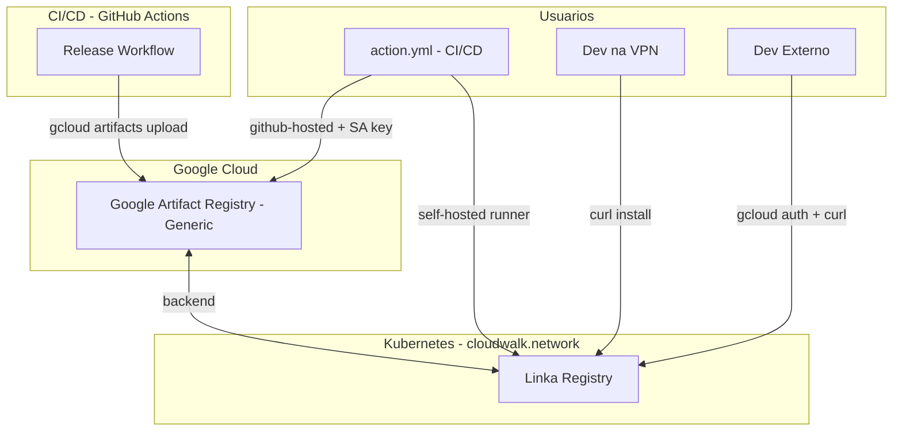

# Distribuicao de Binarios github-builder

## Linear Project

- **Projeto**: [GithubBuilder V3](https://linear.app/cloudwalk/project/githubbuilder-v3-5fb2d23ede0f)
- **Team**: Self Driven Platform (PLTFRM)
- **Label**: `github-builder`

## Objetivo

Substituir o sistema atual de distribuicao (GitHub Artifacts) por uma solucao baseada em Google Artifact Registry + Linka Registry no Kubernetes, removendo a dependencia do GitHub Token para download e mantendo tudo autenticado.

## Arquitetura



## Mapeamento de Repositorios

| Tarefa               | Repositorio            | Caminho                                                   |
| -------------------- | ---------------------- | --------------------------------------------------------- |
| Criar GAR (Generic)  | terraform              | `terraform-projects/tf-tooling/artifact-registry/main.tf` |
| IAM/Service Accounts | terraform              | `terraform-projects/tf-tooling/permissions/`              |
| Helm chart Linka     | resources-provisioning | `charts/linka-registry/` (novo)                           |
| ArgoCD Application   | resources-provisioning | `clusters-config/tool-1-use4/`                            |
| Release workflow     | github-builder         | `.github/workflows/release.yml`                           |
| install.sh           | github-builder         | `install.sh`                                              |
| action.yml           | github-builder         | `action.yml`                                              |

## Fases de Implementacao

### Fase 1: Infraestrutura GCP (repo: terraform)

Criar em `terraform-projects/tf-tooling/artifact-registry/main.tf`:

- Repositorio generico no Google Artifact Registry para binarios
- Service account para upload (CI/CD) e download (Linka)
- IAM permissions para acesso

### Fase 2: Helm Chart Linka (repo: resources-provisioning)

Criar Helm chart proprio em `charts/linka-registry/` (Linka nao possui chart oficial):

```
charts/linka-registry/
├── Chart.yaml
├── values.yaml
├── templates/
│   ├── _helpers.tpl
│   ├── deployment.yaml
│   ├── service.yaml
│   ├── configmap.yaml
│   └── virtualservice.yaml
└── README.md
```

### Fase 3: Deploy Linka (repo: resources-provisioning)

- ArgoCD Application em `clusters-config/tool-1-use4/`
- Exposicao: `binaries.services.tooling.cloudwalk.network`

### Fase 4: Pipeline de Release (repo: github-builder)

Atualizar `.github/workflows/release.yml` para upload ao GAR apos build.

### Fase 5: Script e Action (repo: github-builder)

- Reescrever `install.sh` para usar Linka/GAR
- Atualizar `action.yml` com nova estrategia de autenticacao

### Fase 6: Migracao

Validar cenarios: self-hosted, github-hosted, local VPN, local externo.

## Decisoes Tecnicas

| Aspecto      | Decisao                                      |
| ------------ | -------------------------------------------- |
| Storage      | Google Artifact Registry (Generic)           |
| Interface    | Linka Registry no Kubernetes (tool-1-use4)   |
| Rede privada | Acesso direto via Linka em cloudwalk.network |
| Rede publica | Autenticacao GCP obrigatoria                 |
| install.sh   | Privado (requer auth ou rede privada)        |
| action.yml   | Abstrai autenticacao para CI/CD              |

## Issues Linear

Criar no projeto [GithubBuilder V3](https://linear.app/cloudwalk/project/githubbuilder-v3-5fb2d23ede0f):

| Issue                                                      | Repo                   |
| ---------------------------------------------------------- | ---------------------- |
| feat(infra): create GAR generic repository for binaries    | terraform              |
| feat(infra): configure IAM and service accounts for GAR    | terraform              |
| feat(chart): create Helm chart for Linka Registry          | resources-provisioning |
| feat(infra): deploy Linka Registry on K8s                  | resources-provisioning |
| feat(ci): update release workflow to upload to GAR         | github-builder         |
| feat(cli): rewrite install.sh for new distribution backend | github-builder         |
| feat(action): update action.yml with new auth strategy     | github-builder         |
| chore(migration): validate and migrate to new distribution | github-builder         |
