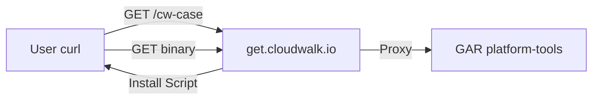

# Distribuição do cw-case via get.cloudwalk.io

## Contexto

O serviço `get-platform-tools` em `get.cloudwalk.io` é **package-agnostic** - qualquer pacote no formato `{package}_{OS}_{arch}.tar.gz` no GAR funciona automaticamente.



## 1. Renomear case-cli para cw-case

Atualizar referências em:

- [apps/case-cli/cli.py](apps/case-cli/cli.py): `CLI_NAME`, `CONFIG_DIR`, mensagens de help
- [apps/case-cli/pyproject.toml](apps/case-cli/pyproject.toml): nome do projeto e entry point
- [apps/case-cli/Makefile](apps/case-cli/Makefile): `CLI_NAME`
- Renomear diretório: `apps/case-cli` → `apps/cw-case`

**Mudanças principais no cli.py:**

```python
CLI_NAME = "cw-case"
CONFIG_DIR = Path.home() / ".cw-case"
```

## 2. Criar novo workflow de build e release

Novo arquivo: `.github/workflows/release-cw-case.yml`

**Build matrix para 4 plataformas:**

| Runner | Platform | Output |

| ------------------ | ------------- | ------------------------------ |

| `ubuntu-latest` | Linux x86_64 | `cw-case_Linux_x86_64.tar.gz` |

| `ubuntu-24.04-arm` | Linux arm64 | `cw-case_Linux_arm64.tar.gz` |

| `macos-14` | Darwin arm64 | `cw-case_Darwin_arm64.tar.gz` |

| `macos-13` | Darwin x86_64 | `cw-case_Darwin_x86_64.tar.gz` |

**Jobs:**

1. **build** - Matrix build com PyInstaller para cada plataforma
2. **package** - Agrupa artifacts e cria checksums
3. **upload-gar** - Upload para GAR usando gcloud CLI

## 3. Criar script upload-to-gar.sh

Novo arquivo: `apps/cw-case/scripts/upload-to-gar.sh`

Baseado em [github-builder/scripts/upload-to-gar.sh](https://github.com/cloudwalk/github-builder/blob/main/scripts/upload-to-gar.sh), adaptado para cw-case:

```bash
GAR_PROJECT="cw-tooling"
GAR_LOCATION="us-east4"
GAR_REPOSITORY="platform-tools"
GAR_PACKAGE="cw-case"
```

## 4. Atualizar PyInstaller spec

Atualizar/criar `apps/cw-case/cw-case.spec` com nome correto do binário.

## 5. Resultado Final

Após implementação:

```bash
# Instalação mais recente
curl -sL "https://get.cloudwalk.io/cw-case" \
  -H "Authorization: Bearer $(gcloud auth print-access-token)" | bash

# Versão específica
curl -sL "https://get.cloudwalk.io/cw-case?version=v1.0.0" \
  -H "Authorization: Bearer $(gcloud auth print-access-token)" | bash
```

## Arquivos a Criar/Modificar

| Arquivo | Ação |

| --------------------------------------- | -------------------------------- |

| `apps/case-cli/` | Renomear para `apps/cw-case/` |

| `apps/cw-case/cli.py` | Atualizar CLI_NAME e referências |

| `apps/cw-case/pyproject.toml` | Atualizar nome do projeto |

| `apps/cw-case/Makefile` | Atualizar CLI_NAME |

| `apps/cw-case/cw-case.spec` | Criar/atualizar PyInstaller spec |

| `apps/cw-case/scripts/upload-to-gar.sh` | Criar script de upload |

| `.github/workflows/release-cw-case.yml` | Criar novo workflow |

| `.github/workflows/build_cli.yaml` | Remover (substituído pelo novo) |
