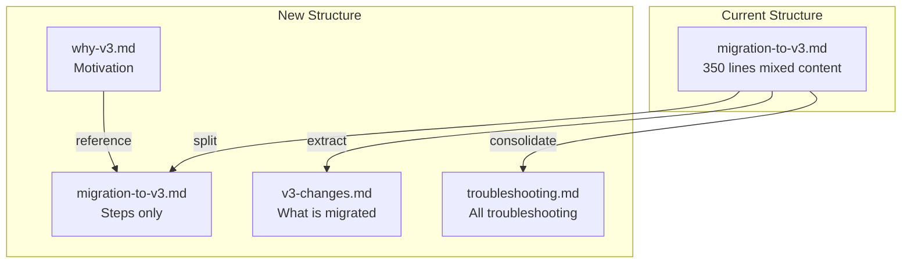

# Documentation Restructure Plan

## Problem Analysis

The current documentation has overlapping responsibilities and content duplication:| Document | Lines | Issues ||----------|-------|--------|| `migration-to-v3.md` | 350 | Mixed content: migration steps, prerequisites, what's being migrated, troubleshooting, rollback, legacy strategy || `why-v3.md` | 303 | Well structured but some content duplicated from migration guide || `cli.md` | 750 | Installation duplicated from migration guide and README || `workflow-examples.md` | 745 | Overlaps with migration guide examples |

## Restructure Strategy

Keep the flat `docs/` structure but apply **Single Responsibility Principle** to each document:



## Changes Overview

### 1. Create: `docs/v3-changes.md` (NEW)

Extract from `migration-to-v3.md`:

- "What are we migrating?" section (lines 12-30)
- Docker build/push changes
- Kubernetes configuration changes
- Deploy workflow changes
- Artifact Registry setup details
- Not Supported Yet section

This document answers: **"What is changing in v3?"**

### 2. Create: `docs/troubleshooting.md` (NEW)

Consolidate troubleshooting from:

- `migration-to-v3.md` (lines 295-311)
- `cli.md` (lines 534-623)
- `github-action.md` (lines 394-468)
- `token-strategy.md` (lines 196-228)

This document answers: **"How do I fix problems?"**

### 3. Refactor: `docs/migration-to-v3.md`

Keep ONLY step-by-step migration instructions:

```markdown
# Migration to github-builder@v3

> For context on why we're migrating, see [Why v3?](./why-v3.md)
> For details on what is being migrated, see [v3 Changes](./v3-changes.md)

## Prerequisites (checklist only)

- [ ] gcloud CLI installed
- [ ] Artifact Registry repository
- [ ] Admin access to GitHub repository
      ...

## Migration Steps

### Step 1: Install CLI

### Step 2: Set environment variables

### Step 3: Upgrade kubernetes config

...

## Next Steps

- See [Troubleshooting](./troubleshooting.md) for common issues
```

**Remove from migration guide:**

- Installation details (reference `cli.md`)
- "What are we migrating" details (move to `v3-changes.md`)
- Troubleshooting section (move to `troubleshooting.md`)
- Legacy monorepo strategy details (keep brief mention with link)

### 4. Update: `docs/why-v3.md`

Add cross-references to new documents:

- Link to `v3-changes.md` for detailed feature list
- Link to `migration-to-v3.md` for migration steps

### 5. Update: `docs/README.md` (within docs folder - optional)

Create an index document for documentation navigation if it doesn't exist.

## File Changes Summary

| File | Action | Description ||------|--------|-------------|| `docs/v3-changes.md` | CREATE | What's being migrated, new features, breaking changes || `docs/troubleshooting.md` | CREATE | Consolidated troubleshooting guide || `docs/migration-to-v3.md` | REFACTOR | Keep only step-by-step instructions || `docs/why-v3.md` | UPDATE | Add cross-references || `README.md` | UPDATE | Update documentation links |

## Cross-Reference Structure

```javascript
migration-to-v3.md
├── references why-v3.md (motivation)
├── references v3-changes.md (what's migrating)
├── references cli.md (installation details)
└── references troubleshooting.md (problem solving)

why-v3.md
├── references v3-changes.md (detailed features)
└── references migration-to-v3.md (how to migrate)

v3-changes.md
├── references why-v3.md (motivation)
└── references migration-to-v3.md (how to migrate)


```
