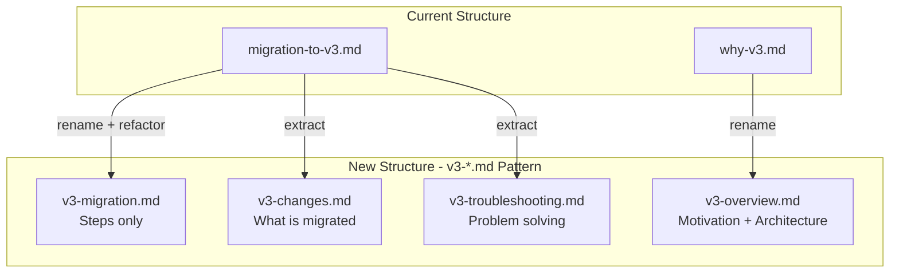

# Documentation Restructure Plan

## Problem Analysis

The current documentation has overlapping responsibilities and content duplication:

| Document               | Lines | Issues                                                                                                           |
| ---------------------- | ----- | ---------------------------------------------------------------------------------------------------------------- |
| `migration-to-v3.md`   | 350   | Mixed content: migration steps, prerequisites, what's being migrated, troubleshooting, rollback, legacy strategy |
| `why-v3.md`            | 303   | Well structured but some content duplicated from migration guide                                                 |
| `cli.md`               | 750   | Installation duplicated from migration guide and README                                                          |
| `workflow-examples.md` | 745   | Overlaps with migration guide examples                                                                           |

## Naming Convention

All v3-related documentation will follow the pattern: **`v3-<topic>.md`**

| Current Name         | New Name                | Rationale                                          |
| -------------------- | ----------------------- | -------------------------------------------------- |
| `migration-to-v3.md` | `v3-migration.md`       | Standardized prefix                                |
| `why-v3.md`          | `v3-overview.md`        | More descriptive, covers motivation + architecture |
| (new)                | `v3-changes.md`         | What's being migrated, breaking changes            |
| (new)                | `v3-troubleshooting.md` | Consolidated troubleshooting for v3                |

## Restructure Strategy



## Document Responsibilities

### `v3-overview.md` (renamed from why-v3.md)

**Focus**: Motivation, architecture decisions, high-level benefits

Content:

- Why Go? Why rewrite?
- Problems with v2
- Solutions in v3
- Architecture overview
- Future possibilities

### `v3-changes.md` (NEW)

**Focus**: What exactly is changing

Content:

- Docker build/push changes (GCR to Artifact Registry)
- Kubernetes config changes (v1 to v2beta1)
- Deploy workflow changes (v2 to v3)
- Breaking changes
- What's not supported yet

### `v3-migration.md` (refactored from migration-to-v3.md)

**Focus**: Step-by-step migration instructions ONLY

Content:

- Prerequisites checklist (links to details)
- Step 1: Install CLI (brief, links to cli.md)
- Step 2: Set environment variables
- Step 3: Upgrade kubernetes config
- Step 4: Validate config
- Step 5: Generate workflows
- Step 6: Test deploy
- Step 7: Commit changes
- Step 8: Validate deployment
- Step 9: Cleanup (if monorepo)
- Next steps (links)

### `v3-troubleshooting.md` (NEW)

**Focus**: Problem solving for v3

Content:

- Common migration issues
- Validation errors
- Deployment issues
- ArgoCD sync problems
- Rollback procedures
- Debug mode instructions

## File Changes Summary

| File                         | Action            | Description                                |
| ---------------------------- | ----------------- | ------------------------------------------ |
| `docs/why-v3.md`             | RENAME            | to `docs/v3-overview.md`                   |
| `docs/migration-to-v3.md`    | RENAME + REFACTOR | to `docs/v3-migration.md`, keep only steps |
| `docs/v3-changes.md`         | CREATE            | Extract "what's migrating" content         |
| `docs/v3-troubleshooting.md` | CREATE            | Consolidate troubleshooting                |
| `README.md`                  | UPDATE            | Update documentation links with new names  |

## Cross-Reference Structure

```
v3-migration.md (entry point for migrating)
├── links v3-overview.md (why migrate?)
├── links v3-changes.md (what's changing?)
├── links cli.md (installation details)
└── links v3-troubleshooting.md (problems?)

v3-overview.md (entry point for understanding)
├── links v3-changes.md (details)
└── links v3-migration.md (ready to migrate?)

v3-changes.md
├── links v3-overview.md (motivation)
└── links v3-migration.md (how to migrate)
```

## Expected Outcome

| Document                | Focus                             | Est. Lines |
| ----------------------- | --------------------------------- | ---------- |
| `v3-migration.md`       | Step-by-step migration only       | ~180       |
| `v3-changes.md`         | What's changing, breaking changes | ~150       |
| `v3-overview.md`        | Motivation, architecture          | ~300       |
| `v3-troubleshooting.md` | Problem-solving guide             | ~250       |

## Documentation Index Update

Update `README.md` documentation section:

```markdown
### User Guides

- **[CLI Documentation](docs/cli.md)** - CLI installation and commands
- **[GitHub Action](docs/github-action.md)** - GitHub Action usage

### v3 Documentation

- **[v3 Overview](docs/v3-overview.md)** - Why v3, motivation, architecture
- **[v3 Changes](docs/v3-changes.md)** - What's new, breaking changes
- **[v3 Migration](docs/v3-migration.md)** - Step-by-step migration guide
- **[v3 Troubleshooting](docs/v3-troubleshooting.md)** - Problem solving
```

## Key Files to Modify

- [`docs/migration-to-v3.md`](docs/migration-to-v3.md) - Rename and refactor
- [`docs/why-v3.md`](docs/why-v3.md) - Rename to v3-overview.md
- [`README.md`](README.md) - Update documentation links
