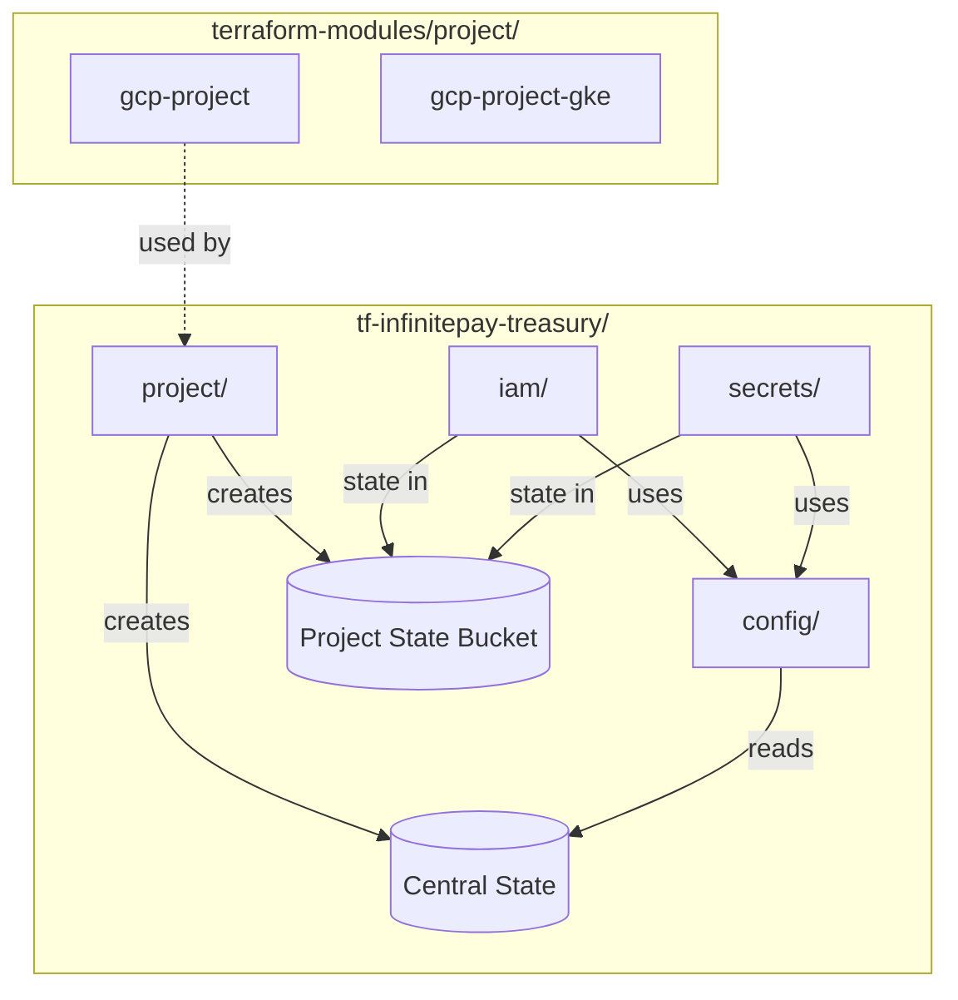

# GCP Project Structure Refactoring Plan (v2)

## Overview

This plan establishes a new standard for GCP project structure, replacing the `_defaults/` pattern with a local `config/` module that reads from remote state, and creating reusable `gcp-project-*` modules.

## Architecture



---

## Phase 1: Linear Issues Setup

Create parent issue with sub-issues in Linear (team: PLTFRM).

**Parent Issue:**

- Title: `feat(terraform): GCP Project Structure Refactoring`
- Description: Epic for refactoring GCP project patterns

**Sub-Issues:**

1. `feat(terraform-modules): extend gcp-project outputs`
2. `feat(terraform-modules): create gcp-project-gke module`
3. `feat(terraform): create config/ module pattern for projects`
4. `feat(terraform): create infinitepay-treasury project`

---

## Phase 2: Extend gcp-project Module

### File: [terraform-modules/project/gcp-project/outputs.tf](terraform-modules/project/gcp-project/outputs.tf)

Add missing outputs for downstream consumers:

```hcl
output "org_id" {
  description = "The GCP Organization ID"
  value       = var.org_id
}

output "billing_account" {
  description = "The GCP Billing Account ID"
  value       = var.billing_account
}
```

### File: [terraform-modules/project/gcp-project/variables.tf](terraform-modules/project/gcp-project/variables.tf)

Review and ensure basic APIs are enabled by default (already present):

- `compute.googleapis.com`
- `iam.googleapis.com`
- `iamcredentials.googleapis.com`
- `cloudresourcemanager.googleapis.com`
- `dns.googleapis.com`
- `secretmanager.googleapis.com`

---

## Phase 3: Create gcp-project-gke Module

### New Module: `terraform-modules/project/gcp-project-gke/`

**Purpose:** Prepare an existing GCP project for GKE clusters.

**File Structure:**

```
project/gcp-project-gke/
├── api-services.tf     # GKE-specific APIs
├── workload-identity.tf # WI Pool for GitHub Actions
├── service-account.tf   # Node SA with standard roles
├── variables.tf
├── outputs.tf
├── versions.tf
└── README.md
```

**APIs Enabled:**

```hcl
locals {
  gke_apis = [
    "container.googleapis.com",
    "gkehub.googleapis.com",
    "containeranalysis.googleapis.com",
    "binaryauthorization.googleapis.com",
    "artifactregistry.googleapis.com",
  ]
}
```

**Resources Created:**

- `google_project_service` - GKE APIs
- `google_iam_workload_identity_pool` - GitHub Actions OIDC
- `google_iam_workload_identity_pool_provider` - GitHub provider
- `google_service_account` - GKE node pool SA with roles:
  - `roles/artifactregistry.reader`
  - `roles/logging.logWriter`
  - `roles/monitoring.metricWriter`
  - `roles/cloudtrace.agent`

**Usage:**

```hcl
module "gke_setup" {
  source = "git::https://github.com/cloudwalk/terraform-modules.git//project/gcp-project-gke?ref=gcp-project-gke@v0.1.0"

  project_id = module.project.project_id
}
```

---

## Phase 4: Create config/ Module Pattern

### New Pattern: Local `config/` module in each project

**Purpose:** Replace `_defaults/` with remote state reading + validation.

**File Structure:**

```
tf-<project-name>/
├── config/
│   ├── main.tf        # Remote state data source
│   ├── outputs.tf     # Expose project values
│   ├── validation.tf  # Preconditions
│   └── versions.tf
├── project/
├── iam/
└── secrets/
```

**config/main.tf:**

```hcl
# Read project outputs from central state
data "terraform_remote_state" "project" {
  backend = "gcs"
  config = {
    bucket = "terraform-state-storage-tooling"
    prefix = "infinitepay-treasury/tfstates-project/"
  }
}
```

**config/outputs.tf:**

```hcl
output "project_id" {
  value = data.terraform_remote_state.project.outputs.project_id
}

output "project_number" {
  value = data.terraform_remote_state.project.outputs.project_number
}

output "region" {
  value = data.terraform_remote_state.project.outputs.region
}

output "team" {
  value = data.terraform_remote_state.project.outputs.team
}

output "environment" {
  value = data.terraform_remote_state.project.outputs.environment
}

output "project_labels" {
  value = data.terraform_remote_state.project.outputs.project_labels
}

output "state_bucket" {
  value = data.terraform_remote_state.project.outputs.state_bucket_name
}
```

**config/validation.tf:**

```hcl
# Validate that project/ has been applied
resource "terraform_data" "validate_project" {
  lifecycle {
    precondition {
      condition     = data.terraform_remote_state.project.outputs.project_id != null
      error_message = "Project must be applied first. Run: cd ../project && terraform apply"
    }
  }
}
```

---

## Phase 5: Create infinitepay-treasury Project

### New Structure: `terraform/terraform-projects/tf-infinitepay-treasury/`

```
tf-infinitepay-treasury/
├── README.md
├── config/
│   ├── main.tf
│   ├── outputs.tf
│   ├── validation.tf
│   └── versions.tf
├── project/
│   ├── main.tf
│   └── provider.tf
├── iam/
│   ├── permissions/
│   │   ├── bindings.tf
│   │   ├── roles.tf
│   │   └── provider.tf
│   └── service-accounts/
│       └── provider.tf
└── secrets/
    └── provider.tf
```

### project/main.tf

```hcl
module "project" {
  source = "git::https://github.com/cloudwalk/terraform-modules.git//project/gcp-project?ref=gcp-project@v0.1.0"

  project_id  = "infinitepay-treasury"
  team        = "treasury"
  environment = "production"
  region      = "us-east4"
}
```

### project/provider.tf

```hcl
terraform {
  required_version = ">= 1.7.4"
  required_providers {
    google = {
      source  = "hashicorp/google"
      version = "~> 7.14"
    }
  }

  backend "gcs" {
    bucket = "terraform-state-storage-tooling"
    prefix = "infinitepay-treasury/tfstates-project/"
  }
}

provider "google" {
  project = "infinitepay-treasury"
  region  = "us-east4"
}
```

### iam/permissions/provider.tf

```hcl
module "config" {
  source = "../../config"
}

locals {
  project        = module.config.project_id
  region         = module.config.region
  project_labels = module.config.project_labels
}

terraform {
  required_version = ">= 1.7.4"
  required_providers {
    google = {
      source  = "hashicorp/google"
      version = "~> 7.14"
    }
  }

  backend "gcs" {
    bucket = "terraform-state-infinitepay-treasury"
    prefix = "tfstates-iam-permissions/"
  }
}

provider "google" {
  project = local.project
  region  = local.region
}
```

---

## State Architecture

| Folder | Backend Bucket | Prefix |

| --------------------- | ------------------------------------ | -------------------------------------- |

| project/ | terraform-state-storage-tooling | infinitepay-treasury/tfstates-project/ |

| iam/permissions/ | terraform-state-infinitepay-treasury | tfstates-iam-permissions/ |

| iam/service-accounts/ | terraform-state-infinitepay-treasury | tfstates-iam-service-accounts/ |

| secrets/ | terraform-state-infinitepay-treasury | tfstates-secrets/ |

---

## Bootstrap Order

1. `project/` must be applied first (creates GCP project AND state bucket)
2. Only after project/ succeeds can config/ be used by other folders
3. iam/ and secrets/ can be applied in any order after project/

---

## Future gcp-project-\* Modules

Based on patterns observed in `tf-cw-sec` and `tf-cw-oneclick`:

| Module | Purpose | APIs |

| ---------------------- | ------------- | --------------------------------------------------------------------------- |

| gcp-project | Core project | compute, iam, dns, secretmanager, cloudresourcemanager |

| gcp-project-gke | GKE readiness | container, gkehub, containeranalysis, binaryauthorization, artifactregistry |

| gcp-project-networking | VPC setup | servicenetworking (for private service connect) |

| gcp-project-cloudsql | CloudSQL | sqladmin, servicenetworking |

---

## Backward Compatibility

- Existing projects (`tf-cw-sec`, `tf-cw-oneclick`) continue using `_defaults/`
- New projects should use the `config/` pattern
- Migration of existing projects is NOT in scope
