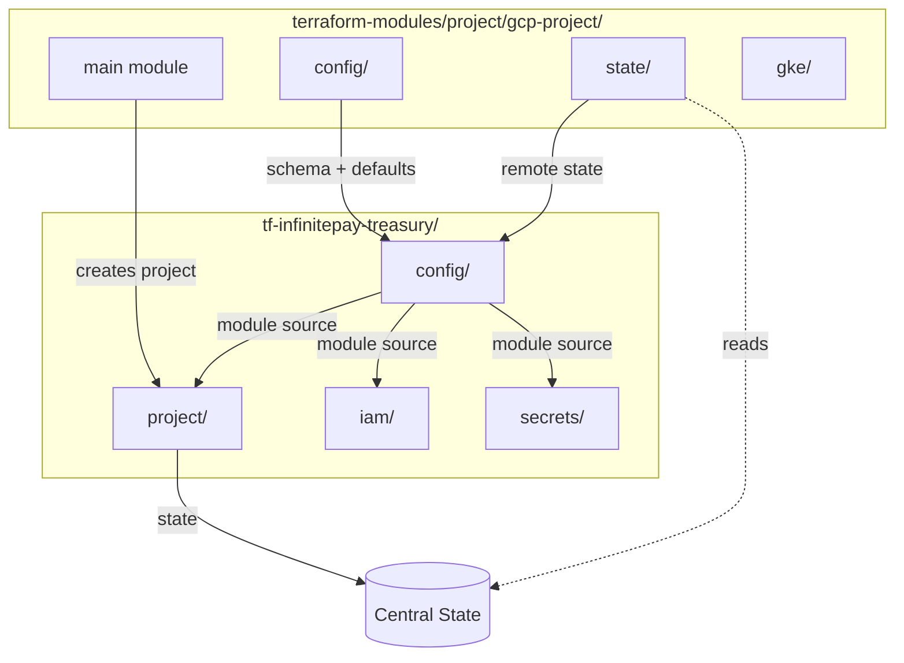

# GCP Project Structure Refactoring Plan (v4)

## Overview

This plan establishes a new standard for GCP project structure with submodules under `gcp-project/`:

- `gcp-project/` - Main module (creates GCP project)
- `gcp-project/config` - Schema, validations, CloudWalk defaults
- `gcp-project/state` - Remote state reader for project outputs
- `gcp-project/gke` - GKE preparation (APIs, Workload Identity, Node SA)

All submodules share a single version tag: `gcp-project@vX.Y.Z`

## Architecture



---

## Phase 1: Linear Issues Setup

Create parent issue with sub-issues in Linear (team: PLTFRM).

**Parent Issue:**

- Title: `feat(terraform): GCP Project Structure Refactoring`
- Description: Epic for standardizing GCP project patterns with reusable submodules

**Sub-Issues:**

1. `feat(terraform-modules): create gcp-project/config submodule`
2. `feat(terraform-modules): create gcp-project/state submodule`
3. `feat(terraform-modules): create gcp-project/gke submodule`
4. `feat(terraform-modules): extend gcp-project outputs`
5. `feat(terraform): create infinitepay-treasury project`

---

## Phase 2: Restructure gcp-project Module

### New Structure: [terraform-modules/project/gcp-project/](terraform-modules/project/gcp-project/)

```
project/gcp-project/
├── main.tf              # Main module - creates GCP project
├── api-services.tf
├── state-bucket.tf
├── outputs.tf
├── variables.tf
├── versions.tf
├── README.md
├── config/              # Submodule: schema + validations
│   ├── main.tf
│   ├── variables.tf
│   ├── outputs.tf
│   ├── versions.tf
│   └── README.md
├── state/               # Submodule: remote state reader
│   ├── main.tf
│   ├── variables.tf
│   ├── outputs.tf
│   ├── versions.tf
│   └── README.md
└── gke/                 # Submodule: GKE preparation
    ├── api-services.tf
    ├── workload-identity.tf
    ├── service-account.tf
    ├── variables.tf
    ├── outputs.tf
    ├── versions.tf
    └── README.md
```

### Module Source Paths

```hcl
# Main module (creates project)
source = "git::https://github.com/cloudwalk/terraform-modules.git//project/gcp-project?ref=gcp-project@v0.1.0"

# Config submodule
source = "git::https://github.com/cloudwalk/terraform-modules.git//project/gcp-project/config?ref=gcp-project@v0.1.0"

# State submodule
source = "git::https://github.com/cloudwalk/terraform-modules.git//project/gcp-project/state?ref=gcp-project@v0.1.0"

# GKE submodule
source = "git::https://github.com/cloudwalk/terraform-modules.git//project/gcp-project/gke?ref=gcp-project@v0.1.0"
```

---

## Phase 3: Create config/ Submodule

### Path: [terraform-modules/project/gcp-project/config/](terraform-modules/project/gcp-project/config/)

**Purpose:** Schema definition, input validation, and CloudWalk defaults. No state, no resources.

**variables.tf:**

```hcl
variable "project_id" {
  description = "The GCP project ID"
  type        = string

  validation {
    condition     = can(regex("^[a-z][a-z0-9-]{4,28}[a-z0-9]$", var.project_id))
    error_message = "Project ID must be 6-30 chars, lowercase, start with letter."
  }
}

variable "team" {
  description = "The team that owns this project"
  type        = string

  validation {
    condition     = length(var.team) > 0
    error_message = "Team is required."
  }
}

variable "environment" {
  description = "The environment type"
  type        = string

  validation {
    condition     = contains(["production", "staging", "development", "security", "sandbox"], var.environment)
    error_message = "Environment must be: production, staging, development, security, sandbox."
  }
}

variable "region" {
  description = "Default GCP region"
  type        = string
  default     = "us-east4"

  validation {
    condition     = contains(["us-east4", "us-central1", "southamerica-east1"], var.region)
    error_message = "Region must be: us-east4, us-central1, southamerica-east1."
  }
}
```

**main.tf:**

```hcl
locals {
  # CloudWalk organization defaults
  org_id          = "198557259264"
  billing_account = "013DCB-89E5D4-5125D4"

  # Computed values
  state_bucket         = "terraform-state-${var.project_id}"
  central_state_bucket = "terraform-state-storage-tooling"

  project_labels = {
    team        = var.team
    environment = var.environment
    managed_by  = "terraform"
  }
}
```

**outputs.tf:**

```hcl
output "project_id"           { value = var.project_id }
output "team"                 { value = var.team }
output "environment"          { value = var.environment }
output "region"               { value = var.region }
output "org_id"               { value = local.org_id }
output "billing_account"      { value = local.billing_account }
output "state_bucket"         { value = local.state_bucket }
output "central_state_bucket" { value = local.central_state_bucket }
output "project_labels"       { value = local.project_labels }
```

---

## Phase 4: Create state/ Submodule

### Path: [terraform-modules/project/gcp-project/state/](terraform-modules/project/gcp-project/state/)

**Purpose:** Read project outputs from remote state. Use when you need real project values like `project_number`.

**variables.tf:**

```hcl
variable "project_id" {
  description = "The project ID to read state from"
  type        = string
}

variable "central_state_bucket" {
  description = "Central state bucket for project bootstrap"
  type        = string
  default     = "terraform-state-storage-tooling"
}
```

**main.tf:**

```hcl
data "terraform_remote_state" "project" {
  backend = "gcs"
  config = {
    bucket = var.central_state_bucket
    prefix = "${var.project_id}/tfstates-project/"
  }
}

resource "terraform_data" "validate" {
  lifecycle {
    precondition {
      condition     = data.terraform_remote_state.project.outputs.project_id != null
      error_message = "Project '${var.project_id}' must be applied first."
    }
  }
}
```

**outputs.tf:**

```hcl
output "project_id"        { value = data.terraform_remote_state.project.outputs.project_id }
output "project_number"    { value = data.terraform_remote_state.project.outputs.project_number }
output "region"            { value = data.terraform_remote_state.project.outputs.region }
output "team"              { value = data.terraform_remote_state.project.outputs.team }
output "environment"       { value = data.terraform_remote_state.project.outputs.environment }
output "project_labels"    { value = data.terraform_remote_state.project.outputs.project_labels }
output "state_bucket_name" { value = data.terraform_remote_state.project.outputs.state_bucket_name }
output "enabled_apis"      { value = data.terraform_remote_state.project.outputs.enabled_apis }
```

---

## Phase 5: Create gke/ Submodule

### Path: [terraform-modules/project/gcp-project/gke/](terraform-modules/project/gcp-project/gke/)

**Purpose:** Prepare an existing GCP project for GKE clusters.

**api-services.tf:**

```hcl
locals {
  gke_apis = [
    "container.googleapis.com",
    "gkehub.googleapis.com",
    "containeranalysis.googleapis.com",
    "binaryauthorization.googleapis.com",
    "artifactregistry.googleapis.com",
  ]
}

resource "google_project_service" "gke_apis" {
  for_each = toset(local.gke_apis)

  project            = var.project_id
  service            = each.value
  disable_on_destroy = false
}
```

**workload-identity.tf:**

```hcl
resource "google_iam_workload_identity_pool" "github" {
  project                   = var.project_id
  workload_identity_pool_id = "github-actions"
  display_name              = "GitHub Actions Identity Pool"
}

resource "google_iam_workload_identity_pool_provider" "github" {
  project                            = var.project_id
  workload_identity_pool_id          = google_iam_workload_identity_pool.github.workload_identity_pool_id
  workload_identity_pool_provider_id = "github-actions-provider"
  display_name                       = "GitHub Actions Provider"

  attribute_mapping = {
    "google.subject"             = "assertion.sub"
    "attribute.repository"       = "assertion.repository"
    "attribute.repository_owner" = "assertion.repository_owner"
  }

  attribute_condition = "assertion.repository_owner == 'cloudwalk'"

  oidc {
    issuer_uri = "https://token.actions.githubusercontent.com"
  }
}
```

**service-account.tf:**

```hcl
resource "google_service_account" "gke_nodepool" {
  project      = var.project_id
  account_id   = "gke-nodepool"
  display_name = "GKE Nodepool Service Account"
}

resource "google_project_iam_member" "gke_nodepool_roles" {
  for_each = toset([
    "roles/artifactregistry.reader",
    "roles/logging.logWriter",
    "roles/monitoring.metricWriter",
    "roles/cloudtrace.agent",
  ])

  project = var.project_id
  role    = each.value
  member  = "serviceAccount:${google_service_account.gke_nodepool.email}"
}
```

---

## Phase 6: Extend gcp-project Main Module

### File: [terraform-modules/project/gcp-project/outputs.tf](terraform-modules/project/gcp-project/outputs.tf)

Add missing outputs for `state/` submodule to consume:

```hcl
output "org_id" {
  description = "The GCP Organization ID"
  value       = var.org_id
}

output "billing_account" {
  description = "The GCP Billing Account ID"
  value       = var.billing_account
}
```

---

## Phase 7: Create infinitepay-treasury Project

### Structure: [terraform/terraform-projects/tf-infinitepay-treasury/](terraform/terraform-projects/tf-infinitepay-treasury/)

```
tf-infinitepay-treasury/
├── README.md
├── config/
│   ├── main.tf
│   ├── outputs.tf
│   └── versions.tf
├── project/
│   ├── main.tf
│   └── provider.tf
├── iam/
│   ├── permissions/
│   │   ├── bindings.tf
│   │   └── provider.tf
│   └── service-accounts/
│       └── provider.tf
└── secrets/
    └── provider.tf
```

### config/main.tf

```hcl
# Configuration (always available, no state dependency)
module "config" {
  source = "git::https://github.com/cloudwalk/terraform-modules.git//project/gcp-project/config?ref=gcp-project@v0.1.0"

  project_id  = "infinitepay-treasury"
  team        = "treasury"
  environment = "production"
  region      = "us-east4"
}

# State (optional - for outputs like project_number)
# Only works after project/ has been applied
module "state" {
  source     = "git::https://github.com/cloudwalk/terraform-modules.git//project/gcp-project/state?ref=gcp-project@v0.1.0"
  project_id = module.config.project_id
}
```

### config/outputs.tf

```hcl
# From config submodule (always available)
output "project_id"      { value = module.config.project_id }
output "team"            { value = module.config.team }
output "environment"     { value = module.config.environment }
output "region"          { value = module.config.region }
output "org_id"          { value = module.config.org_id }
output "billing_account" { value = module.config.billing_account }
output "state_bucket"    { value = module.config.state_bucket }
output "project_labels"  { value = module.config.project_labels }

# From state submodule (requires project/ applied)
output "project_number"  { value = module.state.project_number }
output "enabled_apis"    { value = module.state.enabled_apis }
```

### project/main.tf

```hcl
module "config" {
  source = "../config"
}

module "project" {
  source = "git::https://github.com/cloudwalk/terraform-modules.git//project/gcp-project?ref=gcp-project@v0.1.0"

  project_id      = module.config.project_id
  team            = module.config.team
  environment     = module.config.environment
  region          = module.config.region
  org_id          = module.config.org_id
  billing_account = module.config.billing_account
}
```

### project/provider.tf

```hcl
terraform {
  required_version = ">= 1.7.4"
  required_providers {
    google = {
      source  = "hashicorp/google"
      version = "~> 7.14"
    }
  }

  backend "gcs" {
    bucket = "terraform-state-storage-tooling"
    prefix = "infinitepay-treasury/tfstates-project/"
  }
}

provider "google" {
  project = "infinitepay-treasury"
  region  = "us-east4"
}
```

### iam/permissions/provider.tf

```hcl
module "config" {
  source = "../../config"
}

terraform {
  required_version = ">= 1.7.4"
  required_providers {
    google = {
      source  = "hashicorp/google"
      version = "~> 7.14"
    }
  }

  backend "gcs" {
    bucket = "terraform-state-infinitepay-treasury"
    prefix = "tfstates-iam-permissions/"
  }
}

provider "google" {
  project = module.config.project_id
  region  = module.config.region
}
```

---

## Module Usage Summary

| Use Case | Submodule | Source Path | Requires project/ applied |

| ------------------------------ | --------- | ------------------------------ | ------------------------- |

| Create GCP project | main | `//project/gcp-project` | No |

| Get project_id, region, labels | config/ | `//project/gcp-project/config` | No |

| Get org_id, billing_account | config/ | `//project/gcp-project/config` | No |

| Get project_number | state/ | `//project/gcp-project/state` | Yes |

| Get enabled_apis | state/ | `//project/gcp-project/state` | Yes |

| Prepare for GKE | gke/ | `//project/gcp-project/gke` | Yes |

---

## Versioning Strategy

Single tag for all submodules: `gcp-project@vX.Y.Z`

- Simplifies dependency management
- All submodules stay in sync
- Breaking changes bump major version for all

---

## Bootstrap Order

1. Create `config/` - defines project configuration
2. Apply `project/` - creates GCP project and state bucket
3. Apply `iam/` and `secrets/` - can use full config outputs including `project_number`

Note: `project/` uses `config/` but only the `config/` submodule outputs (no state dependency).

---

## Backward Compatibility

- Existing projects (`tf-cw-sec`, `tf-cw-oneclick`) continue using `_defaults/`
- New projects should use the `config/` pattern with `gcp-project/config` and `gcp-project/state`
- Migration of existing projects is NOT in scope
