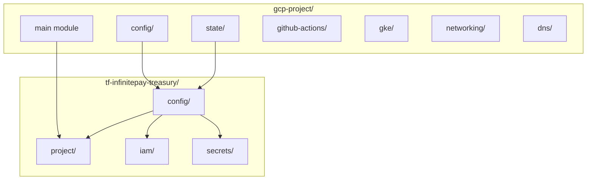

# GCP Project Structure Refactoring Plan (v5)

## Overview

This plan establishes a new standard for GCP project structure with six submodules under `gcp-project/`:

| Submodule | Purpose |

| ----------------- | ----------------------------------------- |

| `config/` | Schema, validations, CloudWalk defaults |

| `state/` | Remote state reader for project outputs |

| `github-actions/` | Workload Identity Pool for CI/CD |

| `gke/` | GKE preparation (APIs, Node SA) |

| `networking/` | Standard VPC with subnets, NAT, router |

| `dns/` | Standard DNS zones (cloudwalk + internal) |

All submodules share a single version tag: `gcp-project@vX.Y.Z`

## Architecture



---

## Phase 1: Linear Issues Setup

Create parent issue with sub-issues in Linear (team: PLTFRM).

**Parent Issue:**

- Title: `feat(terraform): GCP Project Structure Refactoring`
- Description: Epic for standardizing GCP project patterns with reusable submodules under gcp-project/

**Sub-Issues:**

1. `feat(terraform-modules): create gcp-project/config submodule`
2. `feat(terraform-modules): create gcp-project/state submodule`
3. `feat(terraform-modules): create gcp-project/github-actions submodule`
4. `feat(terraform-modules): create gcp-project/gke submodule`
5. `feat(terraform-modules): create gcp-project/networking submodule`
6. `feat(terraform-modules): create gcp-project/dns submodule`
7. `feat(terraform-modules): extend gcp-project outputs`
8. `feat(terraform): create infinitepay-treasury project`

---

## Final Module Structure

```
terraform-modules/project/gcp-project/
├── main.tf                 # Main module - creates GCP project
├── api-services.tf
├── state-bucket.tf
├── outputs.tf
├── variables.tf
├── versions.tf
├── README.md
├── config/                 # Schema + validations + defaults
│   ├── main.tf
│   ├── variables.tf
│   ├── outputs.tf
│   └── versions.tf
├── state/                  # Remote state reader
│   ├── main.tf
│   ├── variables.tf
│   ├── outputs.tf
│   └── versions.tf
├── github-actions/         # WI Pool for GitHub Actions
│   ├── main.tf
│   ├── variables.tf
│   ├── outputs.tf
│   └── versions.tf
├── gke/                    # GKE preparation
│   ├── api-services.tf
│   ├── service-account.tf
│   ├── variables.tf
│   ├── outputs.tf
│   └── versions.tf
├── networking/             # Standard VPC setup
│   ├── main.tf
│   ├── variables.tf
│   ├── outputs.tf
│   └── versions.tf
└── dns/                    # Standard DNS zones
    ├── main.tf
    ├── variables.tf
    ├── outputs.tf
    └── versions.tf
```

---

## Phase 2: Create config/ Submodule

### Path: `terraform-modules/project/gcp-project/config/`

**Purpose:** Schema definition, input validation, and CloudWalk defaults. No state, no resources.

**variables.tf:**

```hcl
variable "project_id" {
  description = "The GCP project ID"
  type        = string

  validation {
    condition     = can(regex("^[a-z][a-z0-9-]{4,28}[a-z0-9]$", var.project_id))
    error_message = "Project ID must be 6-30 chars, lowercase, start with letter."
  }
}

variable "team" {
  description = "The team that owns this project"
  type        = string

  validation {
    condition     = length(var.team) > 0
    error_message = "Team is required."
  }
}

variable "environment" {
  description = "The environment type"
  type        = string

  validation {
    condition     = contains(["production", "staging", "development", "security", "sandbox"], var.environment)
    error_message = "Environment must be: production, staging, development, security, sandbox."
  }
}

variable "region" {
  description = "Default GCP region"
  type        = string
  default     = "us-east4"

  validation {
    condition     = contains(["us-east4", "us-central1", "southamerica-east1"], var.region)
    error_message = "Region must be: us-east4, us-central1, southamerica-east1."
  }
}
```

**main.tf:**

```hcl
locals {
  org_id               = "198557259264"
  billing_account      = "013DCB-89E5D4-5125D4"
  state_bucket         = "terraform-state-${var.project_id}"
  central_state_bucket = "terraform-state-storage-tooling"

  project_labels = {
    team        = var.team
    environment = var.environment
    managed_by  = "terraform"
  }
}
```

**outputs.tf:**

```hcl
output "project_id"           { value = var.project_id }
output "team"                 { value = var.team }
output "environment"          { value = var.environment }
output "region"               { value = var.region }
output "org_id"               { value = local.org_id }
output "billing_account"      { value = local.billing_account }
output "state_bucket"         { value = local.state_bucket }
output "central_state_bucket" { value = local.central_state_bucket }
output "project_labels"       { value = local.project_labels }
```

---

## Phase 3: Create state/ Submodule

### Path: `terraform-modules/project/gcp-project/state/`

**Purpose:** Read project outputs from remote state.

**variables.tf:**

```hcl
variable "project_id" {
  description = "The project ID to read state from"
  type        = string
}

variable "central_state_bucket" {
  description = "Central state bucket for project bootstrap"
  type        = string
  default     = "terraform-state-storage-tooling"
}
```

**main.tf:**

```hcl
data "terraform_remote_state" "project" {
  backend = "gcs"
  config = {
    bucket = var.central_state_bucket
    prefix = "${var.project_id}/tfstates-project/"
  }
}

resource "terraform_data" "validate" {
  lifecycle {
    precondition {
      condition     = data.terraform_remote_state.project.outputs.project_id != null
      error_message = "Project '${var.project_id}' must be applied first."
    }
  }
}
```

**outputs.tf:**

```hcl
output "project_id"        { value = data.terraform_remote_state.project.outputs.project_id }
output "project_number"    { value = data.terraform_remote_state.project.outputs.project_number }
output "region"            { value = data.terraform_remote_state.project.outputs.region }
output "team"              { value = data.terraform_remote_state.project.outputs.team }
output "environment"       { value = data.terraform_remote_state.project.outputs.environment }
output "project_labels"    { value = data.terraform_remote_state.project.outputs.project_labels }
output "state_bucket_name" { value = data.terraform_remote_state.project.outputs.state_bucket_name }
output "enabled_apis"      { value = data.terraform_remote_state.project.outputs.enabled_apis }
```

---

## Phase 4: Create github-actions/ Submodule

### Path: `terraform-modules/project/gcp-project/github-actions/`

**Purpose:** Create Workload Identity Pool and Provider for GitHub Actions OIDC authentication.

**variables.tf:**

```hcl
variable "project_id" {
  description = "The GCP project ID"
  type        = string
}

variable "pool_id" {
  description = "Workload Identity Pool ID"
  type        = string
  default     = "github-actions"
}

variable "github_org" {
  description = "GitHub organization to allow"
  type        = string
  default     = "cloudwalk"
}
```

**main.tf:**

```hcl
resource "google_project_service" "iamcredentials" {
  project            = var.project_id
  service            = "iamcredentials.googleapis.com"
  disable_on_destroy = false
}

resource "google_iam_workload_identity_pool" "github" {
  project                   = var.project_id
  workload_identity_pool_id = var.pool_id
  display_name              = "GitHub Actions"
  description               = "Workload Identity Pool for GitHub Actions OIDC"

  depends_on = [google_project_service.iamcredentials]
}

resource "google_iam_workload_identity_pool_provider" "github" {
  project                            = var.project_id
  workload_identity_pool_id          = google_iam_workload_identity_pool.github.workload_identity_pool_id
  workload_identity_pool_provider_id = "github-provider"
  display_name                       = "GitHub Actions Provider"

  attribute_mapping = {
    "google.subject"             = "assertion.sub"
    "attribute.repository"       = "assertion.repository"
    "attribute.repository_owner" = "assertion.repository_owner"
    "attribute.actor"            = "assertion.actor"
  }

  attribute_condition = "assertion.repository_owner == '${var.github_org}'"

  oidc {
    issuer_uri = "https://token.actions.githubusercontent.com"
  }
}
```

**outputs.tf:**

```hcl
output "pool_id" {
  value = google_iam_workload_identity_pool.github.workload_identity_pool_id
}

output "pool_name" {
  value = google_iam_workload_identity_pool.github.name
}

output "provider_name" {
  value = google_iam_workload_identity_pool_provider.github.name
}

# For use in service account workload identity bindings
output "principal_set" {
  description = "Principal set for all GitHub Actions from the org"
  value       = "principalSet://iam.googleapis.com/${google_iam_workload_identity_pool.github.name}/*"
}
```

---

## Phase 5: Create gke/ Submodule

### Path: `terraform-modules/project/gcp-project/gke/`

**Purpose:** Enable GKE APIs and create node pool service account.

**api-services.tf:**

```hcl
locals {
  gke_apis = [
    "container.googleapis.com",
    "gkehub.googleapis.com",
    "containeranalysis.googleapis.com",
    "binaryauthorization.googleapis.com",
    "artifactregistry.googleapis.com",
  ]
}

resource "google_project_service" "gke" {
  for_each = toset(local.gke_apis)

  project            = var.project_id
  service            = each.value
  disable_on_destroy = false
}
```

**service-account.tf:**

```hcl
resource "google_service_account" "gke_nodepool" {
  project      = var.project_id
  account_id   = var.nodepool_sa_name
  display_name = "GKE Nodepool Service Account"
}

resource "google_project_iam_member" "gke_nodepool" {
  for_each = toset([
    "roles/artifactregistry.reader",
    "roles/logging.logWriter",
    "roles/monitoring.metricWriter",
    "roles/cloudtrace.agent",
  ])

  project = var.project_id
  role    = each.value
  member  = "serviceAccount:${google_service_account.gke_nodepool.email}"

  depends_on = [google_project_service.gke]
}
```

**variables.tf:**

```hcl
variable "project_id" {
  description = "The GCP project ID"
  type        = string
}

variable "nodepool_sa_name" {
  description = "Service account name for GKE nodepools"
  type        = string
  default     = "gke-nodepool"
}
```

**outputs.tf:**

```hcl
output "nodepool_sa_email" {
  value = google_service_account.gke_nodepool.email
}

output "nodepool_sa_name" {
  value = google_service_account.gke_nodepool.name
}

output "enabled_apis" {
  value = local.gke_apis
}
```

---

## Phase 6: Create networking/ Submodule

### Path: `terraform-modules/project/gcp-project/networking/`

**Purpose:** Create standard VPC with public/private subnets, router, and NAT.

**variables.tf:**

```hcl
variable "project_id" {
  description = "The GCP project ID"
  type        = string
}

variable "region" {
  description = "GCP region"
  type        = string
}

variable "network_name" {
  description = "Base name for the network (will be suffixed with -net)"
  type        = string
}

variable "public_subnet_cidr" {
  description = "CIDR for public subnet"
  type        = string
}

variable "private_subnet_cidr" {
  description = "CIDR for private subnet"
  type        = string
}

variable "nat_ip_count" {
  description = "Number of NAT IPs to reserve"
  type        = number
  default     = 2
}

variable "routing_mode" {
  description = "VPC routing mode"
  type        = string
  default     = "REGIONAL"
}
```

**main.tf:**

```hcl
resource "google_compute_network" "vpc" {
  name                    = "${var.network_name}-net"
  project                 = var.project_id
  auto_create_subnetworks = false
  routing_mode            = var.routing_mode
  mtu                     = 1460
}

resource "google_compute_subnetwork" "public" {
  name                     = "${var.network_name}-net-public-0"
  project                  = var.project_id
  region                   = var.region
  network                  = google_compute_network.vpc.id
  ip_cidr_range            = var.public_subnet_cidr
  private_ip_google_access = false
}

resource "google_compute_subnetwork" "private" {
  name                     = "${var.network_name}-net-private-0"
  project                  = var.project_id
  region                   = var.region
  network                  = google_compute_network.vpc.id
  ip_cidr_range            = var.private_subnet_cidr
  private_ip_google_access = true
}

resource "google_compute_router" "router" {
  name    = "${var.network_name}-router"
  project = var.project_id
  region  = var.region
  network = google_compute_network.vpc.id
}

resource "google_compute_address" "nat" {
  count   = var.nat_ip_count
  name    = "${var.network_name}-nat-ip-${count.index}"
  project = var.project_id
  region  = var.region
}

resource "google_compute_router_nat" "nat" {
  name                               = "${var.network_name}-nat"
  project                            = var.project_id
  region                             = var.region
  router                             = google_compute_router.router.name
  nat_ip_allocate_option             = "MANUAL_ONLY"
  nat_ips                            = google_compute_address.nat[*].self_link
  source_subnetwork_ip_ranges_to_nat = "ALL_SUBNETWORKS_ALL_IP_RANGES"

  log_config {
    enable = true
    filter = "ERRORS_ONLY"
  }
}

resource "google_compute_route" "egress_internet" {
  name             = "${var.network_name}-egress-internet"
  project          = var.project_id
  network          = google_compute_network.vpc.name
  dest_range       = "0.0.0.0/0"
  next_hop_gateway = "default-internet-gateway"
  priority         = 1000
}
```

**outputs.tf:**

```hcl
output "vpc_id"              { value = google_compute_network.vpc.id }
output "vpc_name"            { value = google_compute_network.vpc.name }
output "vpc_self_link"       { value = google_compute_network.vpc.self_link }
output "public_subnet_id"    { value = google_compute_subnetwork.public.id }
output "public_subnet_name"  { value = google_compute_subnetwork.public.name }
output "private_subnet_id"   { value = google_compute_subnetwork.private.id }
output "private_subnet_name" { value = google_compute_subnetwork.private.name }
output "router_name"         { value = google_compute_router.router.name }
output "nat_ips"             { value = google_compute_address.nat[*].address }
```

---

## Phase 7: Create dns/ Submodule

### Path: `terraform-modules/project/gcp-project/dns/`

**Purpose:** Create standard DNS zones (cloudwalk for Tailscale access, internal for VPC only).

**variables.tf:**

```hcl
variable "project_id" {
  description = "The GCP project ID"
  type        = string
}

variable "dns_prefix" {
  description = "DNS prefix for zones (e.g., 'security' creates security.cloudwalk and security.internal)"
  type        = string
}

variable "vpc_self_link" {
  description = "Self link of the VPC for DNS visibility"
  type        = string
}

variable "additional_networks" {
  description = "Additional VPC networks that can resolve the cloudwalk zone"
  type        = list(string)
  default     = []
}
```

**main.tf:**

```hcl
# Zone accessible via Tailscale: <prefix>.cloudwalk
resource "google_dns_managed_zone" "cloudwalk" {
  project     = var.project_id
  name        = "${var.dns_prefix}-cloudwalk"
  dns_name    = "${var.dns_prefix}.cloudwalk."
  description = "Private DNS zone for ${var.dns_prefix} - accessible via Tailscale"
  visibility  = "private"

  private_visibility_config {
    dynamic "networks" {
      for_each = concat([var.vpc_self_link], var.additional_networks)
      content {
        network_url = networks.value
      }
    }
  }
}

# Zone for VPC-only access: <prefix>.internal
resource "google_dns_managed_zone" "internal" {
  project     = var.project_id
  name        = "${var.dns_prefix}-internal"
  dns_name    = "${var.dns_prefix}.internal."
  description = "Private DNS zone for ${var.dns_prefix} - VPC only"
  visibility  = "private"

  private_visibility_config {
    networks {
      network_url = var.vpc_self_link
    }
  }
}
```

**outputs.tf:**

```hcl
output "cloudwalk_zone_name"    { value = google_dns_managed_zone.cloudwalk.name }
output "cloudwalk_zone_dns"     { value = google_dns_managed_zone.cloudwalk.dns_name }
output "internal_zone_name"     { value = google_dns_managed_zone.internal.name }
output "internal_zone_dns"      { value = google_dns_managed_zone.internal.dns_name }
```

---

## Phase 8: Extend gcp-project Main Module

### File: `terraform-modules/project/gcp-project/outputs.tf`

Add missing outputs:

```hcl
output "org_id" {
  description = "The GCP Organization ID"
  value       = var.org_id
}

output "billing_account" {
  description = "The GCP Billing Account ID"
  value       = var.billing_account
}
```

---

## Phase 9: Create infinitepay-treasury Project

### Structure: `terraform/terraform-projects/tf-infinitepay-treasury/`

```
tf-infinitepay-treasury/
├── README.md
├── config/
│   ├── main.tf
│   ├── outputs.tf
│   └── versions.tf
├── project/
│   ├── main.tf
│   └── provider.tf
├── iam/
│   ├── permissions/
│   │   ├── bindings.tf
│   │   └── provider.tf
│   └── service-accounts/
│       └── provider.tf
└── secrets/
    └── provider.tf
```

### config/main.tf

```hcl
module "config" {
  source = "git::https://github.com/cloudwalk/terraform-modules.git//project/gcp-project/config?ref=gcp-project@v0.1.0"

  project_id  = "infinitepay-treasury"
  team        = "treasury"
  environment = "production"
  region      = "us-east4"
}

module "state" {
  source     = "git::https://github.com/cloudwalk/terraform-modules.git//project/gcp-project/state?ref=gcp-project@v0.1.0"
  project_id = module.config.project_id
}
```

### project/main.tf

```hcl
module "config" {
  source = "../config"
}

module "project" {
  source = "git::https://github.com/cloudwalk/terraform-modules.git//project/gcp-project?ref=gcp-project@v0.1.0"

  project_id      = module.config.project_id
  team            = module.config.team
  environment     = module.config.environment
  region          = module.config.region
  org_id          = module.config.org_id
  billing_account = module.config.billing_account
}
```

---

## Module Usage Summary

| Use Case | Submodule | Source Path |

| ------------------------- | --------------- | -------------------------------------- |

| Create GCP project | main | `//project/gcp-project` |

| Get config values | config/ | `//project/gcp-project/config` |

| Read project state | state/ | `//project/gcp-project/state` |

| Setup GitHub Actions OIDC | github-actions/ | `//project/gcp-project/github-actions` |

| Prepare for GKE | gke/ | `//project/gcp-project/gke` |

| Create standard VPC | networking/ | `//project/gcp-project/networking` |

| Create DNS zones | dns/ | `//project/gcp-project/dns` |

---

## APIs Enabled by Each Module

| Module | APIs |

| ------------------ | ----------------------------------------------------------------------------------------- |

| gcp-project (main) | compute, iam, iamcredentials, cloudresourcemanager, dns, secretmanager, container, gkehub |

| github-actions/ | iamcredentials |

| gke/ | container, gkehub, containeranalysis, binaryauthorization, artifactregistry |

| networking/ | compute (inherited) |

| dns/ | dns (inherited) |

---

## Versioning Strategy

Single tag for all submodules: `gcp-project@vX.Y.Z`

Example usage:

```hcl
source = "git::https://github.com/cloudwalk/terraform-modules.git//project/gcp-project/config?ref=gcp-project@v0.1.0"
source = "git::https://github.com/cloudwalk/terraform-modules.git//project/gcp-project/state?ref=gcp-project@v0.1.0"
source = "git::https://github.com/cloudwalk/terraform-modules.git//project/gcp-project/networking?ref=gcp-project@v0.1.0"
```

---

## Backward Compatibility

- Existing projects (`tf-cw-sec`, `tf-cw-oneclick`) continue using `_defaults/` and individual modules
- New projects should use the new `gcp-project/*` submodules
- Migration of existing projects is NOT in scope
