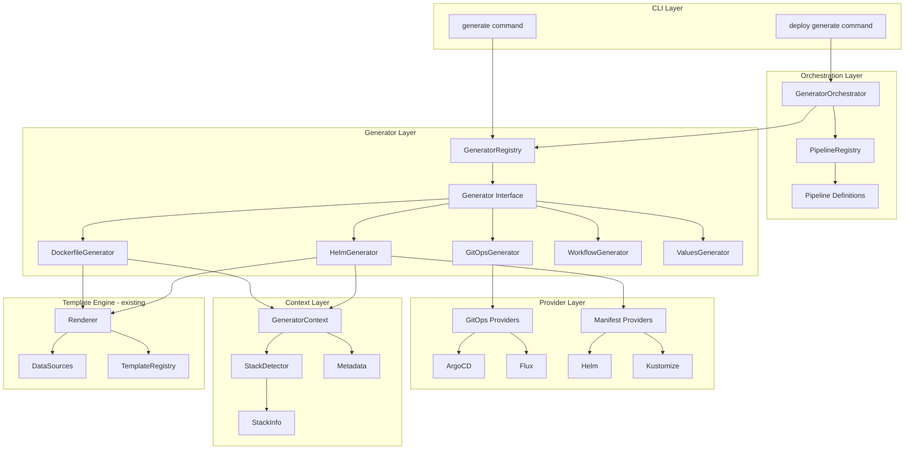

# Generator Pipeline Engine

## Contexto

A engine atual em [`internal/generate`](github-builder/internal/generate) já possui geradores para Helm e ArgoCD, mas precisa evoluir para:

- Suportar detecção de múltiplas stacks (monorepos, múltiplos Dockerfiles)
- Orquestrar geração de múltiplos artefatos de deploy de forma composável
- Abstrair providers de GitOps (ArgoCD, Flux) e engines de manifests (Helm, Kustomize)
- Manter compatibilidade com `internal/template` até sua deprecação completa

## Arquitetura Proposta



## Estrutura de Arquivos

```
internal/generator/
├── context.go              # GeneratorContext
├── detector.go             # StackDetector interface + impl
├── stack.go                # StackInfo, StackRegistry
├── generator.go            # Generator interface + registry
├── orchestrator.go         # Pipeline orchestration
├── pipeline.go             # Pipeline + GeneratorStep types
├── result.go               # GeneratorResult types
├── schema.go               # GeneratorSchema for AI/automation
│
├── stacks/                 # Stack detection implementations
│   ├── go.go
│   ├── node.go
│   ├── python.go
│   ├── ruby.go
│   └── java.go
│
├── providers/
│   ├── gitops/
│   │   ├── interface.go
│   │   ├── argocd.go
│   │   └── flux.go
│   └── manifest/
│       ├── interface.go
│       ├── helm.go
│       └── kustomize.go
│
├── generators/
│   ├── dockerfile/
│   │   ├── generator.go
│   │   └── templates/
│   ├── helm/
│   │   ├── generator.go
│   │   └── templates/
│   ├── values/
│   │   ├── generator.go
│   │   └── templates/
│   ├── gitops/
│   │   ├── generator.go
│   │   └── templates/
│   └── workflows/
│       ├── generator.go
│       └── templates/
│
└── pipelines/
    ├── registry.go
    └── defaults/
        ├── kubernetes-deploy.yaml
        └── flux-deploy.yaml
```

---

## Fase 1: Foundation - Stack Detection

### 1.1 Criar estruturas base do novo package

Criar [`internal/generator/stack.go`](github-builder/internal/generator/stack.go):

```go
// StackInfo representa informações de uma stack detectada
type StackInfo struct {
    Name          string            // "go", "node", "python"
    Language      string            // linguagem principal
    Version       string            // versão detectada
    BuildTool     string            // "go", "npm", "yarn", "pip"
    PackageFile   string            // go.mod, package.json
    Framework     string            // "gin", "express", "django"
    DockerBase    string            // imagem base recomendada
    BuildCommand  string            // comando de build
    TestCommand   string            // comando de test
    Confidence    float64           // 0.0 a 1.0
    DetectedFiles []string          // arquivos que levaram à detecção
    Extra         map[string]string // dados específicos da stack
    Path          string            // path relativo (para monorepos)
}

// StackRegistry gerencia stacks registradas
type StackRegistry struct {
    stacks map[string]*StackDefinition
}
```

### 1.2 Implementar StackDetector com suporte a múltiplas stacks

Criar [`internal/generator/detector.go`](github-builder/internal/generator/detector.go):

```go
// StackDetector detecta stacks em um projeto
type StackDetector interface {
    // Detect retorna a stack principal detectada
    Detect(projectPath string) (*StackInfo, error)

    // DetectAll retorna todas as stacks detectadas (monorepos)
    DetectAll(projectPath string) ([]*StackInfo, error)

    // DetectAt retorna stack em um path específico
    DetectAt(projectPath string, relativePath string) (*StackInfo, error)
}
```

Tabela de detecção:

| Stack | Arquivos Primários | Arquivos Secundários | Framework Detection |

|-------|-------------------|---------------------|---------------------|

| Go | `go.mod` | `go.sum`, `main.go` | gin, echo, fiber via imports |

| Node | `package.json` | `yarn.lock`, `pnpm-lock.yaml` | express, nest, next via deps |

| Python | `pyproject.toml`, `requirements.txt` | `Pipfile`, `setup.py` | django, flask, fastapi |

| Ruby | `Gemfile` | `Gemfile.lock` | rails, sinatra |

| Java | `pom.xml`, `build.gradle` | `.java` files | spring, quarkus |

### 1.3 Implementar detectores por stack

Criar arquivos em [`internal/generator/stacks/`](github-builder/internal/generator/stacks/):

- `go.go` - detecta Go, frameworks (gin, echo), versão de go.mod
- `node.go` - detecta Node, package manager, frameworks
- `python.go` - detecta Python, versão, frameworks
- `ruby.go` - detecta Ruby, frameworks
- `java.go` - detecta Java/Kotlin, build tool, frameworks

---

## Fase 2: Generator Interface e Registry

### 2.1 Definir Generator interface

Criar [`internal/generator/generator.go`](github-builder/internal/generator/generator.go):

```go
// Generator interface para todos os geradores
type Generator interface {
    Name() string
    Description() string

    // Schema para AI/automações
    InputSchema() *GeneratorSchema
    OutputSchema() *GeneratorSchema

    // Dependências
    Dependencies() []string

    // Execução
    Generate(ctx *GeneratorContext) (*GeneratorResult, error)
    Validate(ctx *GeneratorContext) error
}

// GeneratorRegistry gerencia generators disponíveis
type GeneratorRegistry struct {
    generators map[string]Generator
}
```

### 2.2 Definir GeneratorContext

Criar [`internal/generator/context.go`](github-builder/internal/generator/context.go):

```go
// GeneratorContext contexto compartilhado entre generators
type GeneratorContext struct {
    // Stack detection
    Stack      *StackInfo
    AllStacks  []*StackInfo  // para monorepos

    // Metadata existente
    Metadata   *metadata.Metadata
    Config     *config_manager.Config

    // Overrides e configuração
    Overrides  map[string]interface{}
    OutputDir  string
    DryRun     bool
    Force      bool  // sobrescreve arquivos existentes

    // Pipeline context
    PipelineName     string
    PreviousResults  map[string]*GeneratorResult

    // Target (para monorepos)
    TargetPath  string  // path específico a processar
}
```

### 2.3 Definir GeneratorResult

Criar [`internal/generator/result.go`](github-builder/internal/generator/result.go):

```go
// GeneratorResult resultado de um generator
type GeneratorResult struct {
    Generator    string
    Files        []GeneratedFile
    Metadata     map[string]interface{}  // dados para próximos generators
    Warnings     []string
    Skipped      bool
    SkipReason   string
}

// GeneratedFile arquivo gerado
type GeneratedFile struct {
    Path        string
    Content     []byte
    Template    string
    Mode        os.FileMode
    FromCache   bool
}
```

### 2.4 Definir GeneratorSchema para AI/automações

Criar [`internal/generator/schema.go`](github-builder/internal/generator/schema.go):

```go
// GeneratorSchema JSON Schema para inputs/outputs
type GeneratorSchema struct {
    Type        string                    `json:"type"`
    Properties  map[string]SchemaProperty `json:"properties"`
    Required    []string                  `json:"required"`
    Description string                    `json:"description"`
}

type SchemaProperty struct {
    Type        string          `json:"type"`
    Description string          `json:"description"`
    Default     interface{}     `json:"default,omitempty"`
    Enum        []string        `json:"enum,omitempty"`
    Items       *SchemaProperty `json:"items,omitempty"`
}
```

---

## Fase 3: Migrar Geradores Existentes

### 3.1 Migrar HelmGenerator

Refatorar [`internal/generate/helm.go`](github-builder/internal/generate/helm.go) para implementar `Generator` interface:

```go
type HelmChartGenerator struct {
    manifestProvider ManifestProvider
}

func (g *HelmChartGenerator) Name() string { return "helm-chart" }
func (g *HelmChartGenerator) Dependencies() []string { return nil }

func (g *HelmChartGenerator) Generate(ctx *GeneratorContext) (*GeneratorResult, error) {
    // Usar metadata do context
    // Delegar para manifestProvider (helm, kustomize)
}
```

### 3.2 Migrar ArgoCDGenerator

Refatorar [`internal/generate/argocd.go`](github-builder/internal/generate/argocd.go):

```go
type GitOpsAppGenerator struct {
    gitopsProvider GitOpsProvider
}

func (g *GitOpsAppGenerator) Name() string { return "gitops-app" }
func (g *GitOpsAppGenerator) Dependencies() []string { return []string{"helm-chart"} }
```

### 3.3 Criar DockerfileGenerator

Novo generator em [`internal/generator/generators/dockerfile/`](github-builder/internal/generator/generators/dockerfile/):

```go
type DockerfileGenerator struct{}

func (g *DockerfileGenerator) Name() string { return "dockerfile" }

func (g *DockerfileGenerator) Generate(ctx *GeneratorContext) (*GeneratorResult, error) {
    // Usar ctx.Stack para selecionar template
    // Suportar múltiplos Dockerfiles para AllStacks
}
```

Templates por stack:

- `templates/go.dockerfile.tpl`
- `templates/node.dockerfile.tpl`
- `templates/python.dockerfile.tpl`

### 3.4 Criar ValuesGenerator

Novo generator para helm values:

```go
type ValuesGenerator struct{}

func (g *ValuesGenerator) Name() string { return "helm-values" }
func (g *ValuesGenerator) Dependencies() []string { return []string{"helm-chart"} }
```

### 3.5 Criar WorkflowGenerator

Novo generator para GitHub workflows:

```go
type WorkflowGenerator struct{}

func (g *WorkflowGenerator) Name() string { return "github-workflows" }
func (g *WorkflowGenerator) Dependencies() []string { return []string{"dockerfile"} }
```

---

## Fase 4: Pipeline Orchestration

### 4.1 Definir Pipeline types

Criar [`internal/generator/pipeline.go`](github-builder/internal/generator/pipeline.go):

```go
// Pipeline define sequência de generators
type Pipeline struct {
    Name        string          `yaml:"name"`
    Description string          `yaml:"description"`
    Generators  []GeneratorStep `yaml:"generators"`
}

// GeneratorStep passo do pipeline
type GeneratorStep struct {
    Generator  string                 `yaml:"generator"`
    Enabled    *bool                  `yaml:"enabled,omitempty"`
    DependsOn  []string               `yaml:"dependsOn,omitempty"`
    Config     map[string]interface{} `yaml:"config,omitempty"`
    OutputPath string                 `yaml:"outputPath,omitempty"`
    Condition  string                 `yaml:"condition,omitempty"` // e.g., "stack.name == 'go'"
}
```

### 4.2 Implementar GeneratorOrchestrator

Criar [`internal/generator/orchestrator.go`](github-builder/internal/generator/orchestrator.go):

```go
// GeneratorOrchestrator executa pipelines
type GeneratorOrchestrator struct {
    generatorRegistry *GeneratorRegistry
    pipelineRegistry  *PipelineRegistry
}

func (o *GeneratorOrchestrator) ExecutePipeline(
    ctx *GeneratorContext,
    pipelineName string,
    opts *OrchestratorOptions,
) (*PipelineResult, error) {
    // 1. Resolver pipeline
    // 2. Ordenar generators por dependências (topological sort)
    // 3. Executar cada generator
    // 4. Passar resultados entre generators
}
```

### 4.3 Definir pipelines default

Criar [`internal/generator/pipelines/defaults/kubernetes-deploy.yaml`](github-builder/internal/generator/pipelines/defaults/kubernetes-deploy.yaml):

```yaml
name: kubernetes-deploy
description: Generate all files for Kubernetes deployment with ArgoCD

generators:
 - generator: dockerfile
    config:
      variant: "{{ .Stack.Name }}"

 - generator: helm-chart
    config:
      type: kubernetes

 - generator: helm-values
    dependsOn: [helm-chart]

 - generator: gitops-app
    dependsOn: [helm-chart]
    config:
      provider: argocd

 - generator: github-workflows
    dependsOn: [dockerfile]
```

---

## Fase 5: Provider Abstraction

### 5.1 GitOps Provider Interface

Criar [`internal/generator/providers/gitops/interface.go`](github-builder/internal/generator/providers/gitops/interface.go):

```go
// GitOpsProvider interface para ArgoCD, Flux, etc
type GitOpsProvider interface {
    Name() string
    GenerateApplication(ctx *GeneratorContext) (*GeneratorResult, error)
    GetRequiredFiles() []RequiredFile
    ValidateSource(sourceType string) error
}
```

### 5.2 ArgoCD Provider

Criar [`internal/generator/providers/gitops/argocd.go`](github-builder/internal/generator/providers/gitops/argocd.go) - refatorar código existente.

### 5.3 Flux Provider (placeholder)

Criar [`internal/generator/providers/gitops/flux.go`](github-builder/internal/generator/providers/gitops/flux.go) - implementação futura.

### 5.4 Manifest Provider Interface

Criar [`internal/generator/providers/manifest/interface.go`](github-builder/internal/generator/providers/manifest/interface.go):

```go
// ManifestProvider interface para Helm, Kustomize, etc
type ManifestProvider interface {
    Name() string
    GenerateStructure(ctx *GeneratorContext) (*GeneratorResult, error)
    GetOutputFormat() OutputFormat
    SupportsMultiEnv() bool
}
```

---

## Fase 6: CLI Integration

### 6.1 Comando `generate` para templates genéricos

Manter [`cmd/generate.go`](github-builder/cmd/generate.go) para:

- `github-builder generate templates` - renderização genérica
- `github-builder generate dockerfile --stack go` - generator individual
- `github-builder generate helm-chart` - generator individual

### 6.2 Novo comando `deploy generate` para pipelines

Novo subcomando em `deploy`:

- `github-builder deploy generate` - executa pipeline completo
- `github-builder deploy generate --pipeline kubernetes-deploy`
- `github-builder deploy generate --skip dockerfile`
- `github-builder deploy generate --only helm-chart,helm-values`

### 6.3 Flags comuns

```
--dry-run           Validate without writing files
--force             Overwrite existing files
--skip <generators> Skip specific generators
--only <generators> Run only specific generators
--stack <name>      Force specific stack (skip detection)
--target <path>     Target specific path (monorepos)
```

---

## Fase 7: Deprecar internal/template

### 7.1 Migrar funcionalidades restantes

- Mover templates de [`internal/template/templates/`](github-builder/internal/template/templates/) para generators
- Migrar `DataSourceProvider` para uso em `GeneratorContext`
- Manter `Renderer` como implementação base

### 7.2 Marcar como deprecated

Adicionar comentários de deprecation e atualizar documentação.

---

## Considerações para Múltiplas Stacks

O design suporta múltiplas stacks através de:

1. **DetectAll()** retorna `[]*StackInfo` para monorepos
2. **GeneratorContext.AllStacks** disponível para generators
3. **GeneratorContext.TargetPath** para processar path específico
4. **DockerfileGenerator** pode gerar múltiplos Dockerfiles:
   - `Dockerfile` (stack principal)
   - `services/api/Dockerfile` (stack secundária)
   - `services/worker/Dockerfile` (outra stack)

Exemplo de uso:

```bash
# Detectar todas as stacks
github-builder generate detect --all

# Gerar Dockerfile para stack específica
github-builder generate dockerfile --target services/api

# Pipeline completo para monorepo
github-builder deploy generate --target services/api
```

---

## Compatibilidade com AI/Automações

O `GeneratorSchema` permite que agentes:

1. Listem generators: `registry.List()`
2. Obtenham schema de inputs: `generator.InputSchema()`
3. Façam perguntas baseadas no schema
4. Executem com inputs coletados
5. Validem resultados via `generator.OutputSchema()`

---

## Ordem de Implementação Sugerida

1. **Fase 1** - Stack Detection (foundation)
2. **Fase 2** - Generator Interface e Registry
3. **Fase 3** - Migrar geradores existentes (Helm, ArgoCD)
4. **Fase 4** - Pipeline Orchestration
5. **Fase 5** - Provider Abstraction
6. **Fase 6** - CLI Integration
7. **Fase 7** - Deprecar internal/template
