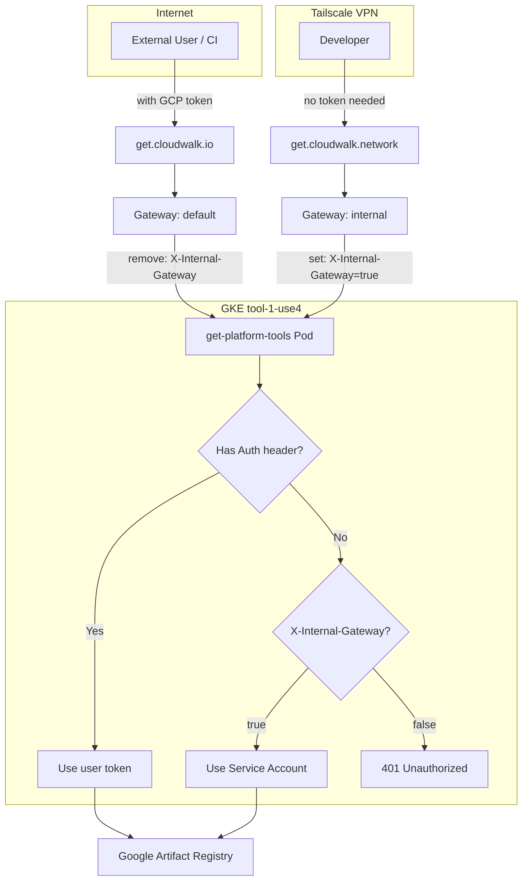

# get-platform-tools GKE Migration Plan

## Architecture



## Changes Required

### 1. Code Changes (get-platform-tools/main.go)

Add support for Service Account authentication via Workload Identity:

- Add dependency: `golang.org/x/oauth2/google`
- Add function `getServiceAccountToken()` using Application Default Credentials
- Modify `handleRequest()` to check `X-Internal-Gateway` header when no Authorization provided
- Add `serveBinaryWithToken()` to abstract token source

Key logic:

```go
if authHeader != "" {
    // Use user token (external requests, CI)
} else if r.Header.Get("X-Internal-Gateway") == "true" {
    // Use Service Account (internal VPN requests)
} else {
    // 401 Unauthorized
}
```

### 2. Kubernetes Configuration

Create [get-platform-tools/.cw/tooling.yaml](get-platform-tools/.cw/tooling.yaml):

- Deployment with Workload Identity annotation
- Service Account: `get-platform-tools`
- Environment variables: GAR_PROJECT, GAR_LOCATION, GAR_REPOSITORY, BOOTSTRAP_URL
- Resources: 256Mi memory, 500m CPU limit
- Replicas: 2 for HA
- Service with port 8080
- Two VirtualServices (internal + external gateways)

Create [get-platform-tools/.cw/helm/Chart.yaml](get-platform-tools/.cw/helm/Chart.yaml):

- Wrapper chart for kubernetes helm chart

### 3. Istio Gateway Configuration

Update [resources-provisioning/clusters-config/tool-1-use4/istio-system/tool-1-use4-internal-gateway.yaml](resources-provisioning/clusters-config/tool-1-use4/istio-system/tool-1-use4-internal-gateway.yaml):

- Add `get.cloudwalk.network` host (HTTP + HTTPS)
- TLS credential: `get-cloudwalk-network`

Update [resources-provisioning/clusters-config/tool-1-use4/istio-system/tool-1-use4-default-gateway.yaml](resources-provisioning/clusters-config/tool-1-use4/istio-system/tool-1-use4-default-gateway.yaml):

- Add `get.cloudwalk.io` host (HTTP + HTTPS)
- TLS credential: `get-cloudwalk-io`

### 4. Istio VirtualServices

Create VirtualService for internal gateway:

- Host: `get.cloudwalk.network`
- Gateway: `istio-system/internal`
- Header injection: `set X-Internal-Gateway: true`
- Route to `get-platform-tools` service

Create VirtualService for external gateway:

- Host: `get.cloudwalk.io`
- Gateway: `istio-system/default`
- Header removal: `remove X-Internal-Gateway` (security)
- Route to `get-platform-tools` service

### 5. Terraform (IAM)

Update [terraform/terraform-projects/tf-tooling/cloud-run/get-platform-tools.tf](terraform/terraform-projects/tf-tooling/cloud-run/get-platform-tools.tf):

Add GAR reader permission:

```hcl
resource "google_artifact_registry_repository_iam_member" "get_platform_tools_gar_reader" {
  repository = "platform-tools"
  role       = "roles/artifactregistry.reader"
  member     = "serviceAccount:get-platform-tools@cw-tooling.iam.gserviceaccount.com"
}
```

Add Workload Identity binding:

```hcl
resource "google_service_account_iam_member" "workload_identity" {
  service_account_id = google_service_account.get_platform_tools.name
  role               = "roles/iam.workloadIdentityUser"
  member             = "serviceAccount:cw-tooling.svc.id.goog[get-platform-tools-tooling/get-platform-tools]"
}
```

### 6. TLS Certificates

Ensure certificates exist for:

- `get-cloudwalk-network` (internal gateway)
- `get-cloudwalk-io` (external gateway)

These may need to be created via cert-manager or manually provisioned.

### 7. DNS Configuration

- `get.cloudwalk.io` -> External Load Balancer (istio-public-ingressgateway)
- `get.cloudwalk.network` -> Internal Load Balancer (istio-internal-ingressgateway)

Update Cloudflare DNS in [terraform/cloudflare/zones/cloudwalk-io/dns.tf](terraform/cloudflare/zones/cloudwalk-io/dns.tf) to point to GKE instead of Cloud Run.

### 8. Workflow Updates

Update [.github/workflows/deploy-get-platform-tools.yml](.github/workflows/deploy-get-platform-tools.yml):

- Change from Cloud Run deploy to `github-builder kubernetes deploy`
- Use context: `tooling`
- Remove Cloud Run specific configuration

### 9. Deprecate Cloud Run (Future)

After validation:

- Remove Cloud Run terraform resources
- Remove Cloud Run domain mapping
- Update documentation

## Migration Strategy

1. Deploy GKE version alongside Cloud Run
2. Test internal endpoint (get.cloudwalk.network)
3. Switch DNS for get.cloudwalk.io to GKE
4. Monitor for issues
5. Remove Cloud Run after validation period

## Files to Create/Modify

| File | Action |

| -------------------------------------------------------------- | ----------------------- |

| `get-platform-tools/main.go` | Modify - add SA auth |

| `get-platform-tools/go.mod` | Modify - add oauth2 dep |

| `get-platform-tools/.cw/tooling.yaml` | Create |

| `get-platform-tools/.cw/helm/Chart.yaml` | Create |

| `resources-provisioning/.../tool-1-use4-internal-gateway.yaml` | Modify |

| `resources-provisioning/.../tool-1-use4-default-gateway.yaml` | Modify |

| `terraform/.../get-platform-tools.tf` | Modify |

| `terraform/cloudflare/.../dns.tf` | Modify |

| `.github/workflows/deploy-get-platform-tools.yml` | Modify |
