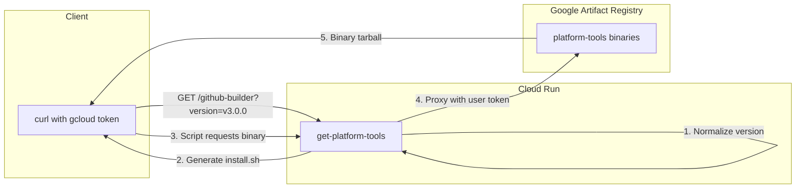

# Get Platform Tools Bootstrap Service

## Overview

Criar serviço Cloud Run que serve como proxy para instalação de ferramentas do Google Artifact Registry, transformando:

```bash
# De (atual - 5 linhas):
curl -sL -H "Authorization: Bearer $(gcloud auth print-access-token)" \
  "https://artifactregistry.googleapis.com/download/v1/projects/cw-tooling/..." | bash

# Para (novo - 2 linhas):
curl -sL "https://get.cloudwalk.io/github-builder?version=v3.0.0" \
  -H "Authorization: Bearer $(gcloud auth print-access-token)" | bash
```

## Architecture



## Files to Create

### 1. Go Service

Create directory `get-platform-tools/` in [github-builder](github-builder/) with:| File | Purpose ||------|---------|| `main.go` | HTTP handlers, version normalization, binary proxy || `templates/install.sh.tmpl` | Embedded bash template for install script || `go.mod` / `go.sum` | Dependencies || `Dockerfile` | Multi-stage build (golang -> distroless) |

### 2. GitHub Workflow

Create [`.github/workflows/get-platform-tools-deploy.yml`](github-builder/.github/workflows/get-platform-tools-deploy.yml):

```yaml
name: Deploy get-platform-tools
on:
  push:
    branches: [main, v3-alpha]
    paths: ['get-platform-tools/**']
  workflow_dispatch:

jobs:
  build:
    uses: cloudwalk/actions/docker-build-push@docker-build-push-v0.2.0
    with:
      project: get-platform-tools
      team: sre
      gcp_project: cw-tooling
      context: get-platform-tools
      file: get-platform-tools/Dockerfile
      short_tags: latest,${{ github.sha }}

  deploy:
    needs: build
    runs-on: ubuntu-latest
    steps:
    - name: Deploy to Cloud Run
        run: |
          gcloud run deploy get-platform-tools \
            --image=${{ needs.build.outputs.image }} \
            --region=us-east4 \
            --project=cw-tooling
```

### 3. Terraform (Initial Setup)

In [terraform/terraform-projects/tf-tooling/](terraform/terraform-projects/tf-tooling/), create `cloud-run/get-platform-tools.tf`:

- Cloud Run service resource with standard labels
- IAM policy (allow unauthenticated)
- Domain mapping for `get.cloudwalk.io`

**Required Labels:**

```hcl
labels = {
  team          = "sre"
  purpose       = "get-platform-tools"
  environment   = "production"
  managed-by    = "terraform"
  repository    = "github-builder"
  public-access = "intentional"
}
```

In [terraform/cloudflare/zones/cloudwalk-io/](terraform/cloudflare/zones/cloudwalk-io/):

- DNS A/CNAME record for `get.cloudwalk.io`
- Use `team_owner = "sre"` in module call

## Key Implementation Details

### Version Normalization (in Go)

| Input | Output ||-------|--------|| `""` or `latest` | `0.0.0-latest` || `v3.0.0` | `v3.0.0` || `main` | `snapshot-main` || `v3-alpha` | `snapshot-v3-alpha` || `feature/xyz` | `snapshot-feature-xyz` |

### Template Variables

```go
type InstallData struct {
    Package      string  // github-builder
    Version      string  // v3.0.0 (normalized)
    BootstrapURL string  // https://get.cloudwalk.io
}
```

## Cleanup
