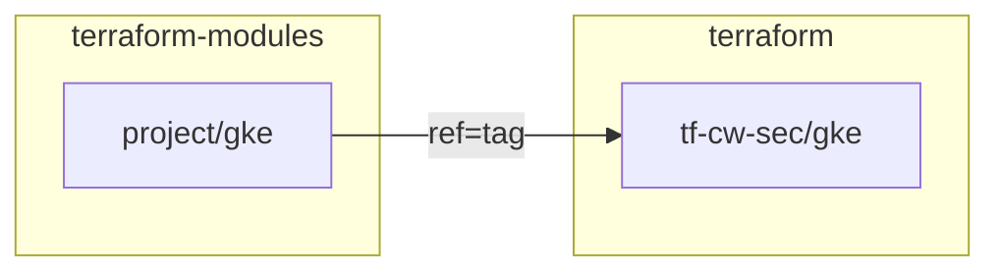

# GKE Autoclass Implementation Plan

## Overview

Enable GKE Autoclass support in the terraform-modules GKE module and implement the cw-sec GKE cluster using Autoclass.

## Decisions Made

| Item      | Decision                                                     |
| --------- | ------------------------------------------------------------ |
| DNS       | No public DNS (`sec-1.cloudwalk.network`), use internal only |
| IPs       | Create both internal and external gateway IPs                |
| Autoclass | Yes, update module and use for cw-sec                        |

## Repositories Involved



---

## Phase 1: Update GKE Module (terraform-modules)

### Linear Issue 1

**Title:** `feat(gke): add Autoclass support to GKE module`

### Changes to `project/gke/`

1. **Update `variable.tf`** - Add new variables:
   - `enable_autoclass` (bool, default: false)
   - `node_service_account` (string, optional)
   - `autoclass_config` (object with autoscaling settings)

2. **Update `gke.tf`** - Add cluster_autoscaling block:

```hcl
dynamic "cluster_autoscaling" {
  for_each = var.enable_autoclass ? [1] : []
  content {
    enabled             = true
    autoscaling_profile = "OPTIMIZE_UTILIZATION"
    auto_provisioning_defaults {
      service_account = var.node_service_account
      # ...
    }
  }
}
```

3. **Update `README.md`** - Document Autoclass usage

4. **Create new tag** after merge (e.g., `gke@v1.1.0`)

---

## Phase 2: Implement cw-sec GKE (terraform)

### Linear Issue 2

**Title:** `feat(cw-sec): add GKE cluster with Autoclass`

### Branch Strategy

```
main
  └── feat/cw-sec-project-bootstrap (PR #10178)
        └── feat/cw-sec-project-setup (PR #10126)
              └── feat/cw-sec-gke-autoclass (NEW - stacked)
```

### Changes to `tf-cw-sec/gke/`

1. **Fix `provider.tf`** - Hardcode backend bucket (same pattern as other folders)

2. **Create `sec-1.tf`** - GKE cluster configuration:
   - GKE cluster with Autoclass enabled
   - Internal IP for Istio gateway
   - External IP for Istio gateway (reserved for future use)
   - NO public DNS zone (using existing `cw-sec.internal`)
   - NO Cloudflare NS delegation

### Resources to Create

| Resource    | Name                | Notes                                   |
| ----------- | ------------------- | --------------------------------------- |
| GKE Cluster | `sec-1`             | Autoclass enabled, no manual node pools |
| Internal IP | `sec-1-internal-ip` | For internal load balancer              |
| External IP | `sec-1-public-ip`   | Reserved for future external access     |

---

## Execution Order

1. Create Linear issues (both)
2. Implement GKE module changes (terraform-modules)
3. Push and create PR for terraform-modules
4. Tag new version after merge
5. Create stacked branch in terraform
6. Implement cw-sec GKE configuration
7. Push and create PR (base: feat/cw-sec-project-setup)

---

## Notes

- The `nodepool` module will NOT be used with Autoclass
- Existing clusters can be migrated to Autoclass later (separate effort)
- The `environment` variable validation in GKE module needs update to include "security"
