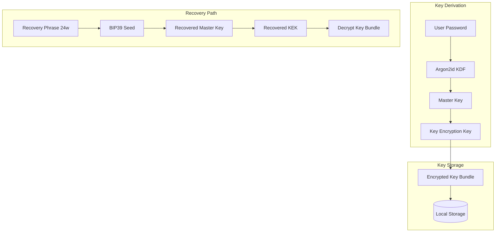
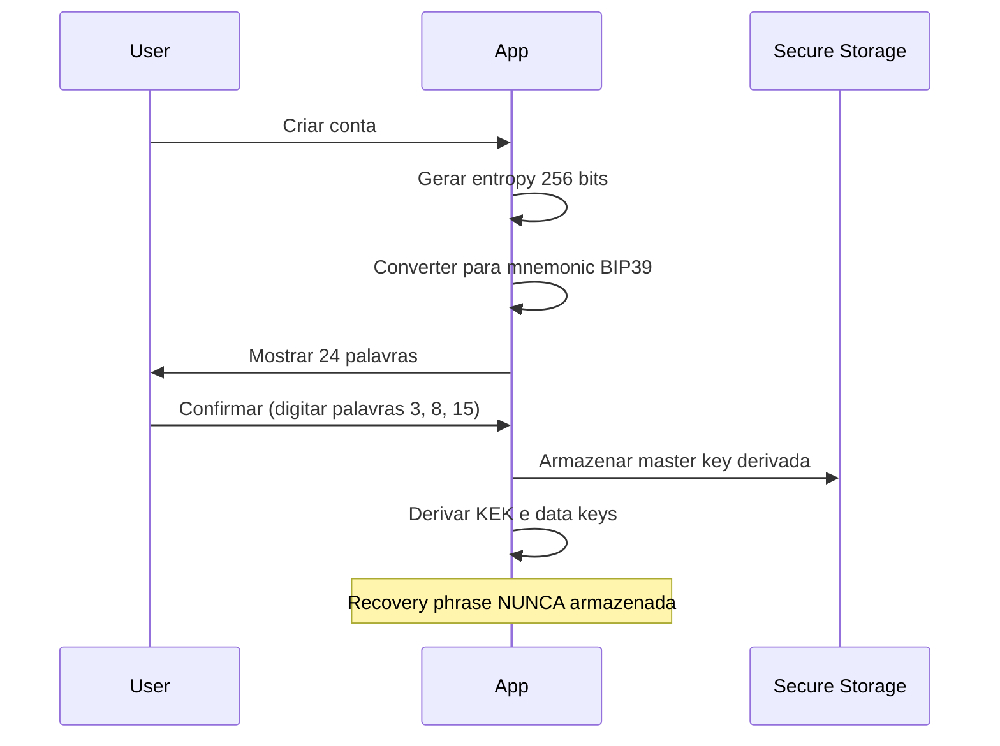
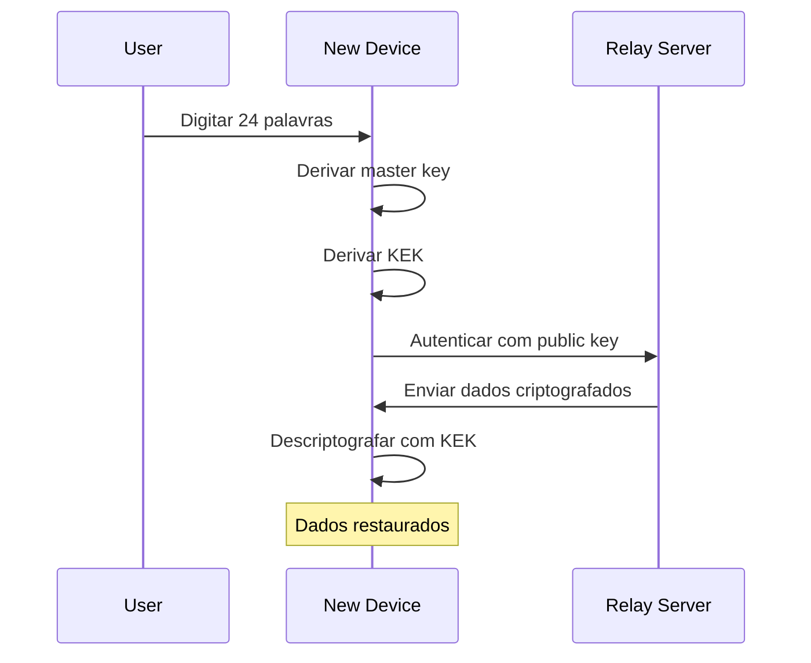
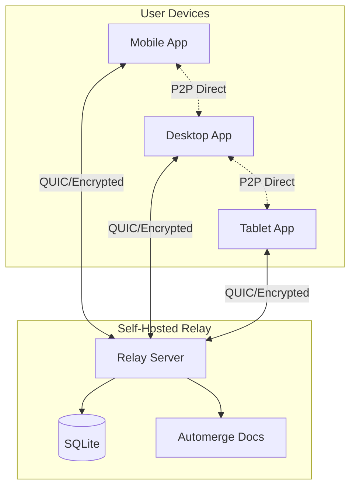
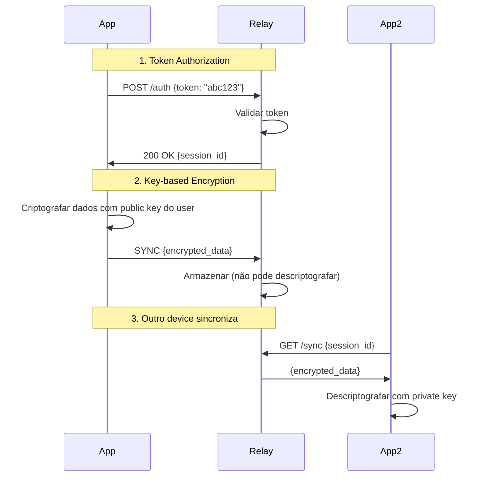
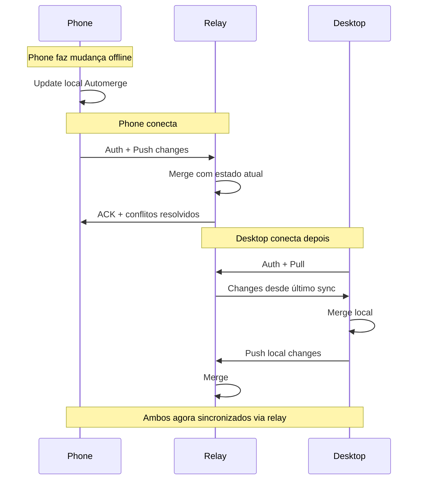

# Key Recovery e Cloud Relay

## Resumo das Decisões

| Aspecto | Decisão |

|---------|---------|

| Key Recovery | Recovery phrase (24 palavras) + trusted contacts (futuro) |

| Cloud Relay | Self-hosted only, full sync node |

| Relay Auth | Key-based (criptografia) + Token (autorização) |

| Relay Storage | Nativo (SQLite/files) |

---

## 1. Key Recovery

### Modelo de Chaves



### Recovery Phrase

**Geração:**

- BIP39 mnemonic (24 palavras)
- Entropy: 256 bits
- Checksum incluído
- Suporte multilíngue (EN, PT-BR)

**Fluxo de Setup:**



**Fluxo de Recovery:**



### Trusted Contacts (Futuro)

Reservado para implementação futura usando Shamir Secret Sharing:

- Usuário escolhe N contatos
- Threshold M de N para recuperar
- Cada contato recebe um share criptografado
- Shares são inúteis individualmente

---

## 2. Cloud Relay

### Arquitetura



### Relay como Full Sync Node

O relay funciona como um peer sempre online:

- Mantém cópia completa dos documentos Automerge
- Dados armazenados criptografados (relay não pode ler)
- Sincroniza com qualquer device que conectar
- Resolve como "bridge" quando devices não estão online simultaneamente

### Autenticação Dual



### Configuração do Relay

**No Relay Server:**

1. Deploy do relay (Docker, binary, ou source)
2. Gerar token de acesso
3. Configurar porta e domínio

**No App:**

1. Settings > Sync > Add Relay
2. URL do relay (ex: `https://my-relay.example.com`)
3. Token de acesso
4. Testar conexão

### Relay Server Spec

```text
Relay Server {
  // Config
  port: integer
  storage_path: string
  max_storage_bytes: integer
  allowed_tokens: string[]

  // Endpoints
  POST /auth          // Authenticate with token
  GET  /sync/:doc_id  // Get document state
  POST /sync/:doc_id  // Push document changes
  WS   /realtime      // WebSocket for live sync

  // Storage
  documents/
    {user_id}/
      {doc_id}.automerge
}
```

### Fluxo de Sync com Relay



---

## 3. Segurança

### Modelo de Ameaças

| Ameaça | Mitigação |

|--------|-----------|

| Relay comprometido | Dados criptografados, relay não tem chaves |

| Token vazado | Revogar token, gerar novo |

| Recovery phrase exposta | Usuário deve gerar nova conta |

| Man-in-the-middle | QUIC com TLS, certificate pinning |

### O que o Relay NÃO pode fazer

- Ler conteúdo dos dados (criptografados)
- Modificar dados sem detecção (Automerge hash chain)
- Impersonar usuário (não tem private key)
- Acessar dados de outros usuários

### O que o Relay PODE fazer (se malicioso)

- Negar serviço (não sincronizar)
- Observar metadados (quando, quanto, frequência)
- Guardar histórico de versões criptografadas

---

## 4. Implementação

### Prioridade

1. **Recovery Phrase** - Crítico para segurança desde o início
2. **Relay Protocol** - Necessário para sync multi-device
3. **Relay Server** - Pode ser implementado depois do protocolo
4. **Trusted Contacts** - Futuro, após validar modelo básico

### Bibliotecas Sugeridas (Rust)

- `bip39` - Geração de mnemonic
- `argon2` - KDF para derivação de chaves
- `x25519-dalek` - Key exchange
- `chacha20poly1305` - Encryption
- `automerge` - CRDT sync
- `quinn` - QUIC transport

---

## 5. Estrutura de Arquivos (Output)

```text
docs/
├── adr/
│   ├── 0003-key-recovery.md      # ADR para key recovery
│   └── 0004-cloud-relay.md       # ADR para cloud relay
└── specs/
    └── infrastructure/
        ├── key-recovery.md       # Spec detalhada
        └── cloud-relay.md        # Spec detalhada
```

---

## Questões em Aberto

- [ ] Rate limiting no relay para prevenir abuse
- [ ] Política de retenção de dados no relay
- [ ] Rotação de tokens de acesso
- [ ] Backup do relay (já que é self-hosted)
