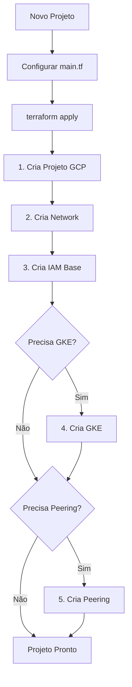

# Plano: Modularização de Projetos GCP

## Objetivo

Transformar a criação de novos projetos GCP em um processo simples e reproduzível, eliminando a necessidade de múltiplos PRs e aplicações manuais do Terraform para resolver dependências.

## Análise da Situação Atual

### Estrutura Atual (cw-sec e cw-oneclick)

Ambos os projetos seguem uma estrutura similar:

- `_defaults/`: Valores centralizados (project, region, team, etc)
- `project/`: Bootstrap do projeto GCP (usa módulo `gcp-project`)
- `networking/`: VPC, subnets, router, NAT, routes, firewall
- `iam/`: Service accounts e permissões
- `gke/`: Cluster GKE e nodepools (apenas cw-sec)
- `clouddns/` ou `cdns/`: DNS privado
- `secrets/`: Secret Manager
- `artifact-registry/`: Registry de imagens (apenas cw-sec)

### Problemas Identificados

1. **Dependências entre módulos**: GKE precisa da VPC, peering precisa ser criado em ambos os projetos
2. **State buckets hardcoded**: Cada módulo precisa conhecer o nome do bucket
3. **Valores duplicados**: `_defaults` precisa ser copiado para cada projeto
4. **Múltiplos PRs necessários**: Projeto → Networking → IAM → GKE → Peering
5. **Peering bidirecional**: Requer coordenação entre projetos

## Proposta de Solução

### Arquitetura Modular

Criar módulos reutilizáveis em `terraform-modules/project/`:

1. **gcp-project-network**: VPC completa com subnets, router, NAT e routes
   - Inputs: project_id, region, vpc_name, cidr_ranges
   - Outputs: vpc_id, vpc_name, subnet_ids, router_id

2. **gcp-project-gke**: Cluster GKE e nodepools
   - Inputs: project_id, region, vpc_name, subnet_name, cidr_ranges
   - Outputs: cluster_name, cluster_endpoint, nodepool_names

3. **gcp-project-iam-base**: Service accounts e permissões base
   - Inputs: project_id, team, custom_roles (opcional)
   - Outputs: service_accounts, custom_role_ids

4. **gcp-project-peering**: Gerencia peering bidirecional entre projetos
   - Inputs: local_project, local_vpc, peer_project, peer_vpc
   - Outputs: peering_id (ambos os lados)

5. **gcp-project-defaults**: Módulo compartilhado de valores padrão
   - Centraliza organization_id, billing_account, labels padrão
   - Pode ser usado via remote state ou como módulo local

### Estrutura Proposta para Novos Projetos

```
tf-<project-name>/
├── main.tf                    # Configuração principal do projeto
├── variables.tf               # Variáveis do projeto
├── outputs.tf                 # Outputs compartilhados
├── terraform.tfvars.example   # Exemplo de valores
├── provider.tf                # Provider e backend config
└── README.md                  # Documentação do projeto
```

### Fluxo de Criação Simplificado



## Implementação

### Fase 1: Criar Módulos Base

1. **gcp-project-network** (`terraform-modules/project/gcp-project-network/`)
   - Consolidar VPC, subnets, router, NAT em um único módulo
   - Suportar múltiplas subnets (public/private)
   - Outputs para uso por outros módulos

2. **gcp-project-gke** (melhorar módulo existente)
   - Aceitar outputs do módulo network
   - Suportar múltiplos nodepools
   - Outputs completos do cluster

3. **gcp-project-iam-base** (`terraform-modules/project/gcp-project-iam-base/`)
   - Service accounts padrão (atlantis, github-actions, etc)
   - Custom roles comuns (clusterAdmin, networkAdmin, etc)
   - Bindings de grupos padrão

4. **gcp-project-peering** (`terraform-modules/project/gcp-project-peering/`)
   - Criar peering em ambos os projetos
   - Usar data sources para pegar VPC IDs
   - Suportar múltiplos peerings

### Fase 2: Criar Módulo de Configuração Compartilhada

1. **gcp-project-config** (`terraform-modules/project/gcp-project-config/`)
   - Valores padrão da organização
   - Funções helper para labels
   - Validações comuns

### Fase 3: Criar Template de Projeto

1. Criar `terraform-projects/templates/gcp-project-template/`
   - Estrutura mínima com todos os módulos
   - Documentação clara
   - Exemplos de uso

### Fase 4: Migrar Projetos Existentes (Opcional)

1. Refatorar cw-sec e cw-oneclick para usar novos módulos
2. Manter compatibilidade com estrutura atual durante transição

## Benefícios

1. **Um único PR**: Toda configuração em um lugar
2. **Sem aplicações manuais**: Terraform resolve dependências automaticamente
3. **Reutilização**: Módulos podem ser combinados conforme necessário
4. **Consistência**: Valores padrão garantidos
5. **Flexibilidade**: Módulos opcionais (GKE, peering, etc)

## Considerações

1. **State Management**:
   - Manter state bucket por projeto
   - Usar remote state data sources para compartilhar valores
   - Considerar terraform_remote_state para outputs entre módulos

2. **Backend Configuration**:
   - Backend ainda precisa ser hardcoded (limitação do Terraform)
   - Criar script helper ou documentação clara

3. **Atlantis Integration**:
   - Configurar workflows para aplicar tudo em ordem
   - Usar `depends_on` no Atlantis para garantir ordem

4. **Peering Bidirecional**:
   - Módulo de peering pode criar ambos os lados se tiver permissão
   - Ou documentar processo de criação em dois PRs coordenados

## Próximos Passos

1. Validar estrutura proposta com time
2. Criar módulos base (Fase 1)
3. Testar com projeto piloto
4. Documentar processo completo
5. Criar template e exemplos
