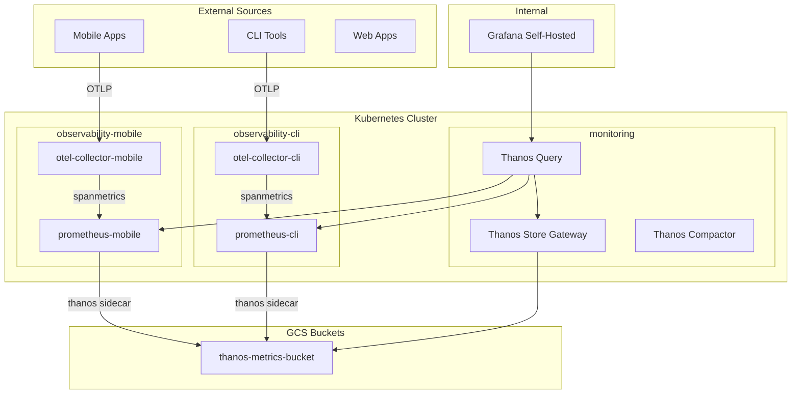

# OTel Collector Multi-Source Evolution Plan v2

## Architecture Overview



## Design Decisions

- **Namespaces by source type**: Each source type gets its own namespace (`observability-mobile`, `observability-cli`) for isolation
- **Configuration via valuesObject**: All environment-specific config in ArgoCD Application files, not in chart values files
- **Convention over configuration**: Sensible defaults; customization via valuesObject when needed
- **No resource profiles**: Single default; each deployment customizes as needed

## Current State

- Chart at [charts/otel-collector-gateway](charts/otel-collector-gateway) with basic structure
- [charts/otel-collector-gateway/values-stg-1.yaml](charts/otel-collector-gateway/values-stg-1.yaml) with too much config (to be removed)
- No dedicated prometheus chart for otel-collector metrics

---

## Phase 1: Enhance otel-collector-gateway Chart

### 1.1 Update values.yaml

Simplify [charts/otel-collector-gateway/values.yaml](charts/otel-collector-gateway/values.yaml):

```yaml
sourceType: "" # Required: mobile, cli, web, etc.
environment: ""
clusterName: ""
gcpProject: ""

replicaCount: 3

resources:
  requests:
    cpu: 500m
    memory: 512Mi
  limits:
    cpu: 1000m
    memory: 1Gi
```

### 1.2 Update helpers.tpl

Modify [charts/otel-collector-gateway/templates/helpers.tpl](charts/otel-collector-gateway/templates/_helpers.tpl) for dynamic naming:

```yaml
{{- define "otel-collector-gateway.fullname" -}}
{{- if .Values.sourceType }}
{{- printf "otel-collector-%s" .Values.sourceType | trunc 63 | trimSuffix "-" }}
{{- else }}
{{- default .Chart.Name .Values.nameOverride | trunc 63 | trimSuffix "-" }}
{{- end }}
{{- end }}
```

### 1.3 Add README.md and values-example.yaml

Create documentation and example in the chart folder.

### 1.4 Delete values-stg-1.yaml

Remove after migration to valuesObject.

---

## Phase 2: Create prometheus-otel Chart

### 2.1 Chart Structure

```
charts/prometheus-otel/
  Chart.yaml
  README.md
  values.yaml
  values-example.yaml
  templates/
    _helpers.tpl
    configmap.yaml
    statefulset.yaml       # Prometheus + Thanos sidecar
    service.yaml
    service-thanos.yaml
    serviceaccount.yaml
```

### 2.2 Default values.yaml

```yaml
sourceType: "" # Required: same as otel-collector
clusterName: ""
gcpProject: ""

resources:
  requests:
    cpu: "500m"
    memory: "2Gi"
  limits:
    cpu: "2"
    memory: "4Gi"

storage:
  size: 50Gi
  storageClass: "standard"

retention: 3d

thanos:
  enabled: true
  image: quay.io/thanos/thanos:v0.35.1

image:
  repository: quay.io/prometheus/prometheus
  tag: v2.55.0
```

---

## Phase 3: ArgoCD Applications with valuesObject

### 3.1 Folder Structure by Source Type

```
clusters-config/stg-1/observability-mobile/
  stg-1-otel-collector-mobile-application.yaml
  stg-1-prometheus-mobile-application.yaml

clusters-config/stg-1/observability-cli/
  stg-1-otel-collector-cli-application.yaml
  stg-1-prometheus-cli-application.yaml
```

### 3.2 otel-collector Application Example

```yaml
apiVersion: argoproj.io/v1alpha1
kind: Application
metadata:
  name: stg-1-otel-collector-mobile
  namespace: argocd
spec:
  destination:
    name: stg-1
    namespace: observability-mobile
  project: infinitepay-staging
  source:
    repoURL: https://github.com/cloudwalk/resources-provisioning.git
    targetRevision: HEAD
    path: charts/otel-collector-gateway
    helm:
      releaseName: otel-collector-mobile
      valuesObject:
        sourceType: mobile
        clusterName: stg-1
        gcpProject: infinitepay-staging
        gcpSecretName: otel-collector-gateway

        serviceAccount:
          annotations:
            iam.gke.io/gcp-service-account: otel-collector@infinitepay-staging.iam.gserviceaccount.com

        virtualService:
          hosts:
            - otel-mobile.services.staging.cloudwalk.network

        config:
          exporters:
            googlecloud:
              project: infinitepay-staging
  syncPolicy:
    syncOptions:
      - ServerSideApply=true
      - CreateNamespace=true
    automated:
      prune: true
      selfHeal: true
```

### 3.3 prometheus-otel Application Example

```yaml
apiVersion: argoproj.io/v1alpha1
kind: Application
metadata:
  name: stg-1-prometheus-mobile
  namespace: argocd
spec:
  destination:
    name: stg-1
    namespace: observability-mobile
  project: infinitepay-staging
  source:
    repoURL: https://github.com/cloudwalk/resources-provisioning.git
    targetRevision: HEAD
    path: charts/prometheus-otel
    helm:
      releaseName: prometheus-mobile
      valuesObject:
        sourceType: mobile
        clusterName: stg-1
        gcpProject: infinitepay-staging

        serviceAccount:
          annotations:
            iam.gke.io/gcp-service-account: monitoring@infinitepay-staging.iam.gserviceaccount.com

        thanos:
          enabled: true
          objstoreBucket: infinitepay-staging-thanos-metrics
  syncPolicy:
    syncOptions:
      - ServerSideApply=true
      - CreateNamespace=true
    automated:
      prune: true
      selfHeal: true
```

---

## Phase 4: Thanos Query Integration

Update [clusters-config/stg-1/monitoring/stg-1-thanos-application.yaml](clusters-config/stg-1/monitoring/stg-1-thanos-application.yaml):

```yaml
query:
  stores:
    - "thanos-sidecar.monitoring.svc.cluster.local:10901"
    - "thanos-storegateway.monitoring.svc.cluster.local:10901"
    - "prometheus-mobile-thanos.observability-mobile.svc.cluster.local:10901"
    - "prometheus-cli-thanos.observability-cli.svc.cluster.local:10901"
```

---

## Phase 5: Documentation

### Chart Documentation

- `charts/otel-collector-gateway/README.md` - Usage, parameters, examples
- `charts/prometheus-otel/README.md` - Usage, Thanos integration

### Architecture Documentation

- `docs/observability/otel-collectors.md` - Architecture, how to add new source types, troubleshooting

---

## Files Summary

### New Files

- `charts/prometheus-otel/Chart.yaml`
- `charts/prometheus-otel/README.md`
- `charts/prometheus-otel/values.yaml`
- `charts/prometheus-otel/values-example.yaml`
- `charts/prometheus-otel/templates/_helpers.tpl`
- `charts/prometheus-otel/templates/statefulset.yaml`
- `charts/prometheus-otel/templates/configmap.yaml`
- `charts/prometheus-otel/templates/service.yaml`
- `charts/prometheus-otel/templates/service-thanos.yaml`
- `charts/prometheus-otel/templates/serviceaccount.yaml`
- `charts/otel-collector-gateway/README.md`
- `charts/otel-collector-gateway/values-example.yaml`
- `clusters-config/stg-1/observability-mobile/stg-1-otel-collector-mobile-application.yaml`
- `clusters-config/stg-1/observability-mobile/stg-1-prometheus-mobile-application.yaml`
- `docs/observability/otel-collectors.md`

### Modified Files

- `charts/otel-collector-gateway/values.yaml` - Simplify, add sourceType
- `charts/otel-collector-gateway/templates/_helpers.tpl` - Dynamic naming
- `clusters-config/stg-1/monitoring/stg-1-thanos-application.yaml` - Add stores

### Files to Delete

- `charts/otel-collector-gateway/values-stg-1.yaml`
- `clusters-config/stg-1/observability/stg-1-otel-collector-gateway-application.yaml`

---

## Deployment Order

1. Create prometheus-otel chart
2. Update otel-collector-gateway chart (values.yaml, helpers.tpl, README)
3. Create ArgoCD applications in `observability-mobile` namespace
4. Test deployment in stg-1
5. Update Thanos Query stores
6. Delete old files
7. Create documentation

---

## Grafana Integration

Grafana is self-hosted at [https://grafana.cloudwalk.network/](https://grafana.cloudwalk.network/):

- Thanos Query already configured as data source
- New prometheus instances queryable via Thanos automatically
- Create dashboards via UI as needed
