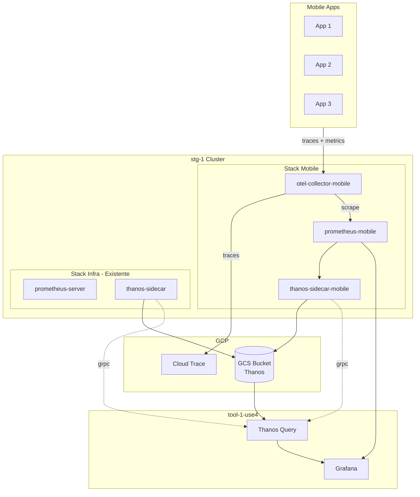

# OTEL Mobile Observability Stack

## Decisoes de Arquitetura

Baseado na discussao:

- **Isolamento**: Critico - mobile nao pode afetar outros sistemas
- **Futuro**: Outros dominios virao em breve (3-6 meses)
- **Gestao**: Mista - Platform gerencia infra, times usam

**Decisao: Stacks separados por dominio com nomenclatura consistente `*-mobile`**

---

## Arquitetura Final



---

## Padrao de Nomenclatura

| Componente | Padrao | Exemplo Mobile | Exemplo Futuro Backend |

| ---------------------- | ---------------------------------- | --------------------------------- | -------------------------- |

| OTEL Collector | `otel-collector-{dominio}` | `otel-collector-mobile` | `otel-collector-backend` |

| Prometheus | `prometheus-{dominio}` | `prometheus-mobile` | `prometheus-backend` |

| Thanos Sidecar Service | `thanos-sidecar-{dominio}` | `thanos-sidecar-mobile` | `thanos-sidecar-backend` |

| VirtualService Host | `otel-{dominio}.services.{env}...` | `otel-mobile.services.staging...` | `otel-backend.services...` |

| Grafana Datasource | `Prometheus {Dominio} {ENV}` | `Prometheus Mobile STG` | `Prometheus Backend STG` |

---

## Fase 1: Ajustes em stg-1

### 1.1 Renomear OTEL Collector (gateway -> mobile)

**Arquivos a modificar/criar:**

1.  **Renomear chart values:**

                        - De: [`charts/otel-collector-gateway/values-stg-1.yaml`](charts/otel-collector-gateway/values-stg-1.yaml)
                        - Para: `charts/otel-collector-mobile/values-stg-1.yaml`

2.  **Copiar/renomear chart inteiro** (ou criar novo):

                        - De: `charts/otel-collector-gateway/`
                        - Para: `charts/otel-collector-mobile/`
                        - Atualizar `Chart.yaml` com novo nome

3.  **Atualizar ArgoCD Application:**

                        - De: [`clusters-config/stg-1/observability/stg-1-otel-collector-gateway-application.yaml`](clusters-config/stg-1/observability/stg-1-otel-collector-gateway-application.yaml)
                        - Para: `clusters-config/stg-1/observability/stg-1-otel-collector-mobile-application.yaml`

4.  **Atualizar VirtualService host:**

                        - De: `otel.services.staging.cloudwalk.network`
                        - Para: `otel-mobile.services.staging.cloudwalk.network`

**Nota:** Sera necessario coordenar com os clientes (mobile apps) a mudanca de endpoint.

### 1.2 Criar Prometheus Mobile

Criar em [`clusters-config/stg-1/monitoring/`](clusters-config/stg-1/monitoring/):

| Arquivo | Descricao |

| --------------------------------------------- | ------------------------------------------------- |

| `stg-1-prometheus-mobile-statefulset.yaml` | StatefulSet com Thanos sidecar |

| `stg-1-prometheus-mobile-configmap.yaml` | ConfigMap com scrape config |

| `stg-1-prometheus-mobile-service.yaml` | Service ClusterIP |

| `stg-1-prometheus-mobile-serviceaccount.yaml` | ServiceAccount + ClusterRole + ClusterRoleBinding |

| `stg-1-thanos-sidecar-mobile-service.yaml` | Service para Thanos sidecar |

**Sizing:**

- CPU: 4 requests / 8 limits
- Memory: 16Gi requests / 32Gi limits
- Storage: 100Gi PVC
- Retention: 7d

**Scrape Config:**

```yaml
global:
  scrape_interval: 30s
  scrape_timeout: 25s
  external_labels:
    cluster: stg-1
    domain: mobile
    prometheus: mobile

scrape_configs:
 - job_name: otel-collector-mobile
    static_configs:
   - targets:
     - otel-collector-mobile.observability.svc.cluster.local:8889
    metric_relabel_configs:
   - source_labels: [__name__]
        regex: "otel.*|traces.*|spans.*|http_.*|rpc_.*"
        action: keep
```

### 1.3 Atualizar Thanos Query

Adicionar novo store em [`clusters-config/stg-1/monitoring/stg-1-thanos-application.yaml`](clusters-config/stg-1/monitoring/stg-1-thanos-application.yaml):

```yaml
query:
  stores:
    - "thanos-sidecar.monitoring.svc.cluster.local:10901" # infra
    - "thanos-sidecar-mobile.monitoring.svc.cluster.local:10901" # mobile (novo)
    - "thanos-storegateway.monitoring.svc.cluster.local:10901"
```

### 1.4 Configurar Grafana (Manual)

Adicionar novo datasource no Grafana (https://grafana.cloudwalk.network/):

| Campo | Valor |

| ------- | ------------------------------------------------------------ |

| Name | `Prometheus Mobile STG` |

| Type | Prometheus |

| URL | `http://prometheus-mobile.monitoring.svc.cluster.local:9090` |

| Default | No |

| Labels | `env: staging`, `domain: mobile` |

---

## Fase 2: Setup em prd-1

### 2.1 Criar OTEL Collector Mobile

Criar:

- `charts/otel-collector-mobile/values-prd-1.yaml`
- `clusters-config/prd-1/observability/prd-1-otel-collector-mobile-application.yaml`

**Ajustes para producao:**

```yaml
environment: production
clusterName: prd-1
gcpProject: infinitepay-production

serviceAccount:
  annotations:
    iam.gke.io/gcp-service-account: otel-collector@infinitepay-production.iam.gserviceaccount.com

virtualService:
  hosts:
  - otel-mobile.services.production.cloudwalk.network

config:
  processors:
    resource:
      attributes:
    - key: environment
          value: production
          action: insert
    - key: cluster
          value: prd-1
          action: insert

  exporters:
    googlecloud:
      project: infinitepay-production
```

### 2.2 Criar Prometheus Mobile

Criar em [`clusters-config/prd-1/monitoring/`](clusters-config/prd-1/monitoring/):

| Arquivo | Descricao |

| --------------------------------------------- | ------------------------------ |

| `prd-1-prometheus-mobile-statefulset.yaml` | StatefulSet com Thanos sidecar |

| `prd-1-prometheus-mobile-configmap.yaml` | ConfigMap |

| `prd-1-prometheus-mobile-service.yaml` | Service |

| `prd-1-prometheus-mobile-serviceaccount.yaml` | ServiceAccount + RBAC |

| `prd-1-thanos-sidecar-mobile-service.yaml` | Service Thanos |

**Sizing Production (maior que staging):**

- CPU: 8 requests / 16 limits
- Memory: 32Gi requests / 64Gi limits
- Storage: 200Gi PVC
- Retention: 7d

### 2.3 Atualizar Thanos Query prd-1

Adicionar store mobile na configuracao do Thanos de prd-1.

### 2.4 Configurar Grafana (Manual)

| Campo | Valor |

| ----- | ------------------------------------------------------------------------ |

| Name | `Prometheus Mobile PRD` |

| URL | `http://prometheus-mobile.monitoring.svc.cluster.local:9090` (via prd-1) |

---

## Melhorias Adicionais (Futuro)

### Alta Prioridade

1. **Sampling no OTEL** - Discutir tail-based vs probabilistic
2. **Resource Limits OTEL** - Aumentar de 1Gi para 4-8Gi para alto volume
3. **HPA para OTEL** - Min 3, Max 10 replicas

### Media Prioridade

4. **PodDisruptionBudget** - Garantir disponibilidade
5. **Network Policies** - Restringir acesso
6. **Alerting** - Prometheus down, OTEL dropping data

### Tarefa Separada

7. **Investigar Thanos atual** - Verificar se dados historicos estao funcionando

---

## Resumo de Arquivos

### Fase 1 - stg-1

| Acao | Arquivo |

| --------- | ----------------------------------------------------------------------------------- |

| Criar | `charts/otel-collector-mobile/` (copiar de otel-collector-gateway) |

| Criar | `charts/otel-collector-mobile/values-stg-1.yaml` |

| Criar | `clusters-config/stg-1/observability/stg-1-otel-collector-mobile-application.yaml` |

| Deletar | `clusters-config/stg-1/observability/stg-1-otel-collector-gateway-application.yaml` |

| Criar | `clusters-config/stg-1/monitoring/stg-1-prometheus-mobile-statefulset.yaml` |

| Criar | `clusters-config/stg-1/monitoring/stg-1-prometheus-mobile-configmap.yaml` |

| Criar | `clusters-config/stg-1/monitoring/stg-1-prometheus-mobile-service.yaml` |

| Criar | `clusters-config/stg-1/monitoring/stg-1-prometheus-mobile-serviceaccount.yaml` |

| Criar | `clusters-config/stg-1/monitoring/stg-1-thanos-sidecar-mobile-service.yaml` |

| Modificar | `clusters-config/stg-1/monitoring/stg-1-thanos-application.yaml` (add store) |

### Fase 2 - prd-1

| Acao | Arquivo |

| --------- | ---------------------------------------------------------------------------------- |

| Criar | `charts/otel-collector-mobile/values-prd-1.yaml` |

| Criar | `clusters-config/prd-1/observability/prd-1-otel-collector-mobile-application.yaml` |

| Criar | `clusters-config/prd-1/monitoring/prd-1-prometheus-mobile-statefulset.yaml` |

| Criar | `clusters-config/prd-1/monitoring/prd-1-prometheus-mobile-configmap.yaml` |

| Criar | `clusters-config/prd-1/monitoring/prd-1-prometheus-mobile-service.yaml` |

| Criar | `clusters-config/prd-1/monitoring/prd-1-prometheus-mobile-serviceaccount.yaml` |

| Criar | `clusters-config/prd-1/monitoring/prd-1-thanos-sidecar-mobile-service.yaml` |

| Modificar | Thanos application prd-1 (add store) |

---

## Pontos de Atencao

1. **Migracao de endpoint**: Clientes mobile precisam atualizar de `otel.services...` para `otel-mobile.services...`
2. **Bucket Thanos**: Reutilizar o bucket existente (todos os dominios no mesmo bucket, separados por labels)
3. **ServiceAccount GCP**: Verificar se precisa criar novo SA ou reutilizar existente
