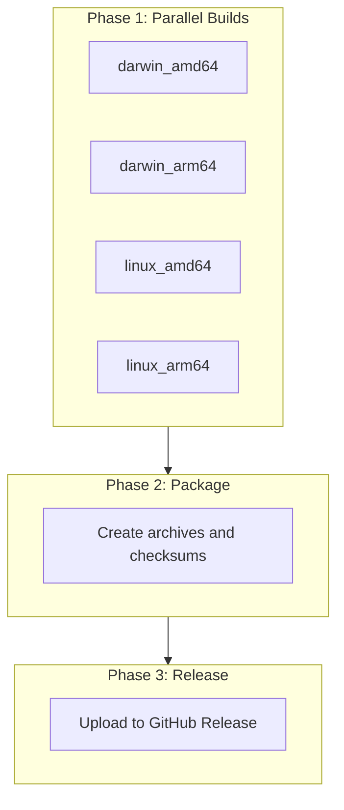

# Parallel Build Pipeline for github-builder

## Context

Current state:

- GoReleaser builds 4 targets sequentially (~13 min total)
- Local build takes < 1 min (M1/M2/M3 is much faster than GitHub runners)
- [install.sh](github-builder/install.sh) already supports downloading individual platform binaries via `download_platform_binary()` function

## Architecture



## Changes Required

### Update [.github/workflows/release.yml](github-builder/.github/workflows/release.yml)

Replace GoReleaser with 3 jobs:

**Job: build (matrix)**

- Matrix: `goos: [darwin, linux]` x `goarch: [amd64, arm64]`
- Each job uploads artifact named `github-builder_{Os}_{arch}` (e.g., `github-builder_Darwin_amd64`)
- Uses `CGO_ENABLED=0` and ldflags `-s -w` for smaller binaries
- Injects version info via ldflags

**Job: package (needs: build)**

- Downloads all 4 artifacts
- Creates `.tar.gz` for each binary
- Generates `checksums.txt` with SHA256
- Uploads consolidated artifact `github-builder-snapshot.zip` (same name as current for compatibility)

**Job: release (needs: package, only on tags)**

- Downloads artifacts
- Creates GitHub Release using `softprops/action-gh-release`
- Uploads all `.tar.gz` files and `checksums.txt`

### Artifact naming convention

Match current GoReleaser naming for compatibility with install.sh:

- Binary: `github-builder_Darwin_amd64` (capital D/L for OS)
- Archive: `github-builder_Darwin_amd64.tar.gz`

### Version injection

Replace GoReleaser's automatic version with manual ldflags:

```bash
go build -ldflags="-s -w \
  -X github.com/cloudwalk/github-builder/cmd.version=${VERSION} \
  -X github.com/cloudwalk/github-builder/cmd.commit=${COMMIT} \
  -X github.com/cloudwalk/github-builder/cmd.date=${DATE}" \
  -o github-builder main.go
```

For snapshots: `VERSION=v3.0.0-alpha+YYYYMMDD-shortsha`
For releases: `VERSION=${GITHUB_REF_NAME}` (the tag)

## Files to Modify

| File                                                                          | Action                          |
| ----------------------------------------------------------------------------- | ------------------------------- |
| [.github/workflows/release.yml](github-builder/.github/workflows/release.yml) | Update with parallel build jobs |

## Expected Results

| Metric                   | Before         | After                 |
| ------------------------ | -------------- | --------------------- |
| Build time               | ~13 min        | ~3-4 min              |
| Artifacts                | 1 zip with all | 4 separate per target |
| install.sh compatibility | Yes            | Yes (same naming)     |

## Rollback Plan

Keep the current [.goreleaser.yaml](github-builder/.goreleaser.yaml) file as backup. If issues arise, revert release.yml to use GoReleaser again.
