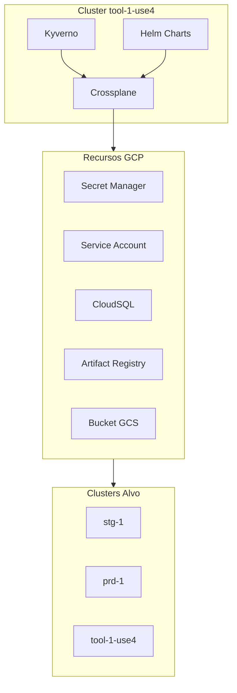

# POC Crossplane - Todo List

## Visao Geral

Este todo list acompanha a implementacao da POC do Crossplane no cluster `tool-1-use4` para gerenciar 5 tipos de recursos GCP: Secret Manager, Service Account, CloudSQL, Artifact Registry e Bucket (GCS).

## Estrutura das Tasks

### Fase 1: Setup Inicial

- Setup do Crossplane no cluster
- Configuracao de namespace e RBAC
- Autenticacao com GCP

### Fase 2: Providers GCP

- Provider Secret Manager
- Provider Service Account (IAM)
- Provider CloudSQL
- Provider Artifact Registry
- Provider Bucket (GCS)

### Fase 3: Politicas

- Instalacao do Kyverno
- Politicas de validacao e seguranca

### Fase 4: Abstracoes

- XRDs e Compositions para cada tipo de recurso
- CloudSQL, Service Account, Artifact Registry, Secret Manager, Bucket

### Fase 5: Helm Charts

- Charts para abstracoes Crossplane
- Documentacao e exemplos

### Fase 6: Migracao

- Selecao de recursos do Terraform (projeto `cw-tooling`)
- Execucao da migracao
- Validacao de equivalencia

### Fase 7: CI/CD e Documentacao

- Integracao com pipelines existentes
- Documentacao tecnica e guias de onboarding

### Fase 8: Validacao Final

- Testes de recursos
- Avaliacao da POC e proximos passos

## Diagrama de Arquitetura

## Dependencias Criticas

1. Cluster `tool-1-use4` disponivel
2. Acesso aos clusters alvo (stg-1, prd-1, tool-1-use4)
3. Permissoes GCP adequadas
4. Acesso ao repositorio `terraform` e projeto `cw-tooling`

## Criterios de Sucesso

- Crossplane funcionando no cluster
- Pelo menos 3 tipos de recursos GCP gerenciados
- Politicas Kyverno implementadas
- Helm charts criados e documentados
- Pelo menos 2 recursos migrados do Terraform
- Documentacao completa
- Validacao por pelo menos 1 time de desenvolvimento

Referencia: [poc-crossplane-planejamento-do-projeto-05a750f3.plan.md](terraform/.cursor/plans/poc-crossplane-planejamento-do-projeto-05a750f3.plan.md)
