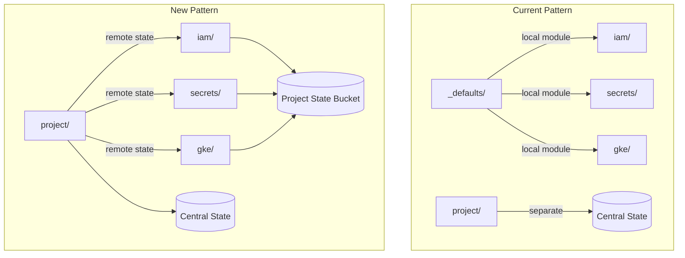

# Project Structure Refactoring Plan

## Overview

This plan establishes a new standard for GCP project structure in terraform, eliminating the `_defaults/` local module pattern in favor of reading outputs from `project/` via remote state.

## Architecture Changes

### Current vs New Pattern



### Key Benefits

- Single source of truth: all project metadata comes from `project/` outputs
- No duplication between `_defaults` inputs and `gcp-project` module inputs
- Cleaner dependency model: `project/` must be applied first

---

## Phase 1: Extend gcp-project Module

### File: [terraform-modules/project/gcp-project/outputs.tf](terraform-modules/project/gcp-project/outputs.tf)

Add additional outputs that were previously in `_defaults`:

```hcl
# Organization-level outputs (for reference)
output "organization_id" {
  description = "The GCP Organization ID"
  value       = var.org_id
}

output "billing_account" {
  description = "The GCP Billing Account ID"
  value       = var.billing_account
}
```

These outputs are already available, just need to verify all necessary values are exported.

---

## Phase 2: Create gcp-project-gke Module

### New Module: `terraform-modules/project/gcp-project-gke/`

This module prepares an existing project for GKE clusters.

**File Structure:**

```
project/gcp-project-gke/
├── main.tf           # Workload Identity Pool creation
├── api-services.tf   # GKE-specific APIs
├── service-account.tf # Node SA and k8s service accounts
├── iam.tf            # IAM bindings for GKE
├── variables.tf      # Input variables
├── outputs.tf        # Module outputs
├── versions.tf       # Provider requirements
└── README.md         # Documentation
```

**APIs to Enable:**

```hcl
variable "gke_apis" {
  default = [
    "container.googleapis.com",
    "gkehub.googleapis.com",
    "containeranalysis.googleapis.com",
    "binaryauthorization.googleapis.com",
    "artifactregistry.googleapis.com",
    "anthos.googleapis.com",
  ]
}
```

**Resources Created:**

- `google_iam_workload_identity_pool` - For GitHub Actions / external identity federation
- `google_iam_workload_identity_pool_provider` - GitHub OIDC provider
- `google_service_account` - Node SA for GKE nodes
- `google_project_iam_member` - IAM bindings for node SA (logging, monitoring, artifact registry)

---

## Phase 3: Create infinitepay-treasury Project

### New Structure: `terraform/terraform-projects/tf-infinitepay-treasury/`

```
tf-infinitepay-treasury/
├── project/
│   ├── main.tf
│   └── provider.tf
├── iam/
│   ├── permissions/
│   │   ├── bindings.tf
│   │   ├── roles.tf
│   │   └── provider.tf
│   └── service-accounts/
│       └── provider.tf
├── secrets/
│   └── provider.tf
└── README.md
```

### Remote State Pattern

Each subfolder (iam/, secrets/) will use this provider pattern:

```hcl
# Read project outputs from remote state
data "terraform_remote_state" "project" {
  backend = "gcs"
  config = {
    bucket = "terraform-state-storage-tooling"
    prefix = "infinitepay-treasury/tfstates-project/"
  }
}

locals {
  project        = data.terraform_remote_state.project.outputs.project_id
  region         = data.terraform_remote_state.project.outputs.region
  project_labels = data.terraform_remote_state.project.outputs.project_labels
}

terraform {
  required_version = ">= 1.7.4"
  required_providers {
    google = {
      source  = "hashicorp/google"
      version = "~> 7.14"
    }
  }

  backend "gcs" {
    # Uses project's state bucket (created by gcp-project module)
    bucket = "terraform-state-infinitepay-treasury"
    prefix = "tfstates-iam-permissions/"
  }
}

provider "google" {
  project = local.project
  region  = local.region
}
```

### project/main.tf

```hcl
module "project" {
  source = "git::https://github.com/cloudwalk/terraform-modules.git//project/gcp-project?ref=gcp-project@v0.1.0"

  project_id  = "infinitepay-treasury"
  team        = "treasury"
  environment = "production"
  region      = "us-east4"

  # CloudWalk defaults (can be omitted, using module defaults)
  org_id          = "198557259264"
  billing_account = "013DCB-89E5D4-5125D4"
}
```

---

## Execution Order

| Step | Repo | Action |

| ---- | ----------------- | ------------------------------------------------- |

| 1 | Linear | Create issue: extend gcp-project outputs |

| 2 | Linear | Create issue: create gcp-project-gke module |

| 3 | Linear | Create issue: create infinitepay-treasury project |

| 4 | terraform-modules | Add outputs to gcp-project module |

| 5 | terraform-modules | Create gcp-project-gke module |

| 6 | terraform | Create tf-infinitepay-treasury structure |

| 7 | terraform | Apply project/ to bootstrap |

| 8 | terraform | Apply iam/ and secrets/ folders |

---

## Considerations

### Backward Compatibility

- Existing projects (tf-cw-sec, tf-cw-oneclick) can continue using `_defaults/`
- New projects should use the remote state pattern
- Migration of existing projects is NOT in scope

### Bootstrap Order

1. `project/` must be applied first (creates the GCP project AND state bucket)
2. Only after project/ succeeds can other folders be applied

### State Bucket Naming

- Central bucket: `terraform-state-storage-tooling` (for project bootstrap)
- Project bucket: `terraform-state-<project-id>` (for all other resources)
