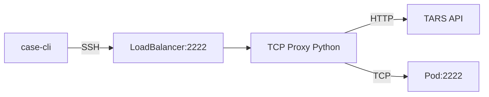
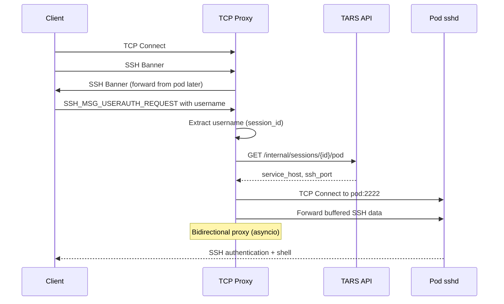

# Pure TCP SSH Proxy in Python

## Architecture



No Istio, no sshd at gateway, single authentication at pod.

## Data Flow



## Implementation

### 1. Create Python TCP Proxy

New file: `apps/ssh-gateway/src/proxy.py` (~150-200 lines)

```python
import asyncio
import httpx

class SSHProxy:
    async def handle_client(self, reader, writer):
        # 1. Buffer initial SSH packets
        # 2. Parse SSH_MSG_USERAUTH_REQUEST to get username
        # 3. Lookup pod via TARS API
        # 4. Connect to pod:2222
        # 5. Forward buffered data
        # 6. Bidirectional copy (asyncio)
```

Key components:

- `parse_ssh_username()` - Extract username from SSH protocol
- `lookup_pod(session_id)` - HTTP call to TARS API
- `proxy_bidirectional()` - Zero-copy forwarding with `asyncio`

### 2. SSH Protocol Parsing

Only need to parse enough to extract username:

```
SSH-2.0-OpenSSH_9.0        <- Banner (text line)
[binary packets...]
SSH_MSG_USERAUTH_REQUEST:
  - packet_length (4 bytes)
  - padding_length (1 byte)
  - message_type (1 byte) = 50
  - username (string)      <- This is what we need
```

### 3. Remove Current Implementation

Delete from `apps/ssh-gateway/`:

- `scripts/entrypoint.sh`
- `scripts/lookup-key.sh`
- `scripts/route-session.sh`
- `config/sshd_config`

### 4. New Dockerfile

```dockerfile
FROM python:3.12-slim

WORKDIR /app
COPY src/proxy.py .
COPY requirements.txt .
RUN pip install --no-cache-dir -r requirements.txt

EXPOSE 2222
CMD ["python", "proxy.py"]
```

Dependencies: `httpx` (async HTTP client)

### 5. Update Kubernetes Manifests

**Service** - Change to LoadBalancer (bypass Istio):

```yaml
apiVersion: v1
kind: Service
metadata:
  name: tars-ssh-proxy
spec:
  type: LoadBalancer
  ports:
    - port: 2222
      targetPort: 2222
```

**Delete**: `apps/ssh-gateway/k8s/virtualservice.yaml` (no Istio needed)

**Update Deployment**: Simpler container, no sshd

### 6. DNS Configuration

Point `tars-claude-ssh.services.tooling.cloudwalk.network` to the LoadBalancer IP instead of Istio Gateway.

## File Changes Summary

| Action | File |

| ------ | ------------------------------------------ |

| Create | `apps/ssh-gateway/src/proxy.py` |

| Create | `apps/ssh-gateway/src/requirements.txt` |

| Update | `apps/ssh-gateway/Dockerfile` |

| Update | `apps/ssh-gateway/k8s/deployment.yaml` |

| Update | `apps/ssh-gateway/k8s/service.yaml` |

| Delete | `apps/ssh-gateway/k8s/virtualservice.yaml` |

| Delete | `apps/ssh-gateway/scripts/*` |

| Delete | `apps/ssh-gateway/config/*` |

| Update | `apps/ssh-gateway/README.md` |

## API Endpoint (already exists)

The `/internal/sessions/{session_id}/pod` endpoint already returns what we need:

```json
{
  "service_host": "pod-name.namespace.svc.cluster.local",
  "ssh_port": 2222,
  "status": "running"
}
```

No changes needed to TARS API.

## Benefits

- Single Python file (~150 lines)
- No sshd, no bash scripts
- Minimal latency (direct TCP proxy)
- Single authentication (at pod)
- Full SSH transparency (port forwarding, scp, etc.)
- Same project/language as TARS
