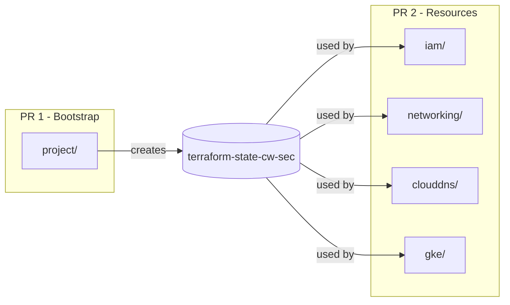

# Separate cw-sec Project Bootstrap from Resources

## Problem

Atlantis cannot execute plans for `iam`, `networking`, `clouddns`, and `gke` because they depend on the bucket `terraform-state-cw-sec` which is created by the `project` terraform configuration. All 7 projects are in the same PR, creating a chicken-and-egg problem.

## Plan

### 1. Create Linear Issue

Create a new Linear issue to track this separation work, linking to the current PR #10126.

### 2. Create Bootstrap Branch

Create a new branch `feat/cw-sec-project-bootstrap` from `main` containing only the project folder changes:

- [terraform-projects/tf-cw-sec/project/](terraform/terraform-projects/tf-cw-sec/project/) (all files)
- [terraform-projects/tf-cw-sec/\_defaults/](terraform/terraform-projects/tf-cw-sec/_defaults/) (dependency)
- Atlantis config entry for `cw-sec-project` only

### 3. Create Bootstrap PR

Open PR with the bootstrap configuration. This PR will:

- Create the GCP project `cw-sec`
- Enable required APIs
- Create the state bucket `terraform-state-cw-sec`

### 4. Update Original PR

After bootstrap PR is merged and applied:

- Rebase `feat/cw-sec-project-setup` on latest `main`
- Remove the already-merged project folder changes
- The remaining resources (iam, networking, clouddns, gke) will now work since the bucket exists

## Files Involved

| PR | Folders ||----|---------|| Bootstrap PR | `_defaults/`, `project/` || Resources PR | `iam/`, `networking/`, `clouddns/`, `gke/` |

## Notes

- The `_defaults` module needs to be in both PRs since all configurations depend on it
