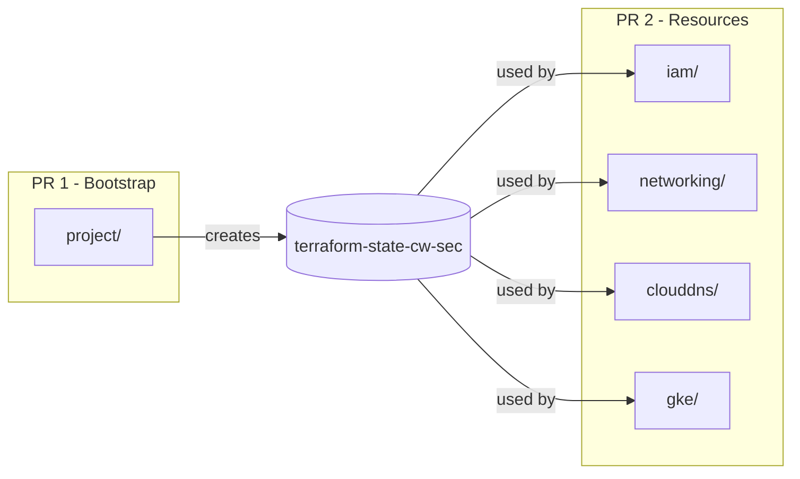

# Separate cw-sec Project Bootstrap from Resources

## Problem

Atlantis cannot execute plans for `iam`, `networking`, `clouddns`, and `gke` because they depend on the bucket `terraform-state-cw-sec` which is created by the `project` terraform configuration. All 7 projects are in the same PR, creating a chicken-and-egg problem.

## Plan

### 1. Create Linear Issue

Create a new Linear issue to track this separation work, linking to the current PR #10126.

### 2. Create Root README.md

Create [terraform-projects/tf-cw-sec/README.md](terraform/terraform-projects/tf-cw-sec/README.md) with:

- Project overview and purpose (Security Operations Center)
- Directory structure documentation
- Deployment order (bootstrap first, then resources)
- Instructions for using this as a template for new GCP projects
- Hardcoded values checklist (backend bucket/prefix that need to be changed when copying)
- Links to existing READMEs in `project/` and `_defaults/`

### 3. Create Bootstrap Branch

Create a new branch `feat/cw-sec-project-bootstrap` from `main` containing only:

- [terraform-projects/tf-cw-sec/README.md](terraform/terraform-projects/tf-cw-sec/README.md) (root documentation)
- [terraform-projects/tf-cw-sec/\_defaults/](terraform/terraform-projects/tf-cw-sec/_defaults/) (dependency)
- [terraform-projects/tf-cw-sec/project/](terraform/terraform-projects/tf-cw-sec/project/) (all files)
- Atlantis config entry for `cw-sec-project` only

### 4. Create Bootstrap PR

Open PR with the bootstrap configuration. This PR will:

- Create the GCP project `cw-sec`
- Enable required APIs
- Create the state bucket `terraform-state-cw-sec`

### 5. Update Original PR

After bootstrap PR is merged and applied:

- Rebase `feat/cw-sec-project-setup` on latest `main`
- Remove the already-merged project folder changes
- The remaining resources (iam, networking, clouddns, gke) will now work since the bucket exists

## Files Involved

| PR           | Folders/Files                                                              |
| ------------ | -------------------------------------------------------------------------- |
| Bootstrap PR | `README.md`, `_defaults/`, `project/`, atlantis entry for `cw-sec-project` |
| Resources PR | `iam/`, `networking/`, `clouddns/`, `gke/`, remaining atlantis entries     |

## README.md Content Outline

The README will serve as the primary reference when copying this structure to new projects:

- Overview of the cw-sec project purpose
- Directory structure with descriptions
- Deployment order diagram
- "Using as Template" section with checklist of hardcoded values:
  - `_defaults/outputs.tf`: project name, region, team, labels
  - `*/provider.tf`: backend bucket and prefix (Terraform limitation)
  - `atlantis-us.yaml`: project entries

## Notes

- The `_defaults` module needs to be in both PRs since all configurations depend on it
- The bootstrap PR uses `terraform-state-storage-tooling` bucket (centralized), so it can run immediately
- Consider closing the current PR #10126 and creating fresh PRs to avoid confusion
