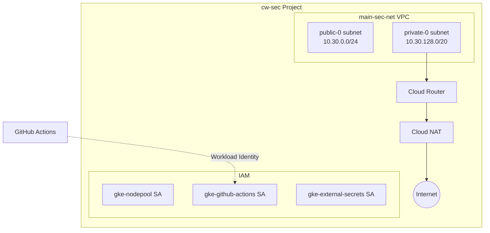

# Setup do Projeto GCP cw-sec

## Visao Geral

Configurar um novo projeto GCP chamado `cw-sec` para o Security Operations Center (SOC), seguindo o padrao estabelecido pela CloudWalk. O setup sera minimo (VPC + IAM), na regiao `us-east4`.

## Pre-requisitos Manuais (fora do Terraform)

Antes de aplicar o Terraform, e necessario:

1. **Criar o projeto no GCP Console** ou via `gcloud`:
   - Nome: `cw-sec`
   - Billing Account vinculada
   - Organizacao CloudWalk

2. **Criar bucket para Terraform state**:
   - Nome sugerido: `terraform-state-sec`
   - Regiao: `us` (multi-regional)
   - Versioning habilitado

## Estrutura de Diretorios

Criar a seguinte estrutura em [terraform/terraform-projects/](terraform/terraform-projects/):

```
tf-cw-sec/
  project/
    provider.tf
    api-services.tf
    workload_identity.tf
  networking/
    main-sec-net/
      main.tf
      provider.tf
      variable.tf
    firewall/
      main.tf
      provider.tf
  iam/
    service-accounts/
      provider.tf
      service-accounts.tf
    permissions/
      provider.tf
      bindings.tf
```

## Componentes do Plano

### 1. Project APIs

Habilitar APIs essenciais no projeto:

- `compute.googleapis.com`
- `container.googleapis.com`
- `secretmanager.googleapis.com`
- `iam.googleapis.com`
- `cloudresourcemanager.googleapis.com`

Referencia: [tf-cw-pci/project/api-services.tf](terraform/terraform-projects/tf-cw-pci/project/api-services.tf)

### 2. Workload Identity

Configurar integracao com GitHub Actions usando o modulo existente:

```hcl
module "workload_identity" {
  source  = "github.com/cloudwalk/terraform-modules/project/github-identity-integration"
  project = "cw-sec"
}
```

### 3. VPC e Networking

Criar VPC `main-sec-net` com:

- Subnet publica: `10.30.0.0/24`
- Subnet privada: `10.30.128.0/20`
- Cloud Router + NAT

Modulos utilizados:

- [terraform-modules/project/vpc](terraform-modules/project/vpc/)
- [terraform-modules/project/vpc-subnetwork](terraform-modules/project/vpc-subnetwork/)
- [terraform-modules/project/vpc-router](terraform-modules/project/vpc-router/)
- [terraform-modules/project/vpc-nat-router](terraform-modules/project/vpc-nat-router/)

### 4. Firewall Rules

Regras basicas de firewall:

- SSH via IAP
- Comunicacao interna
- Egress para internet

### 5. Service Accounts

Service accounts iniciais:

- `gke-nodepool` - Para futuros nodepools GKE
- `gke-github-actions` - Para deploy via GitHub Actions
- `gke-external-secrets` - Para External Secrets Operator

### 6. IAM Bindings

Configurar permissoes basicas para o time de Security.

## Ordem de Aplicacao

1. `project/` - APIs e Workload Identity
2. `networking/main-sec-net/` - VPC e subnets
3. `networking/firewall/` - Regras de firewall
4. `iam/service-accounts/` - Service accounts
5. `iam/permissions/` - Bindings de permissoes

## Diagrama de Arquitetura



## Proximos Passos (Apos Setup Minimo)

Quando necessario, adicionar:

- GKE cluster para workloads de seguranca
- CloudSQL para dados do SOC
- Secret Manager para credenciais
- Pub/Sub para eventos de seguranca
- VMs para ferramentas especificas
