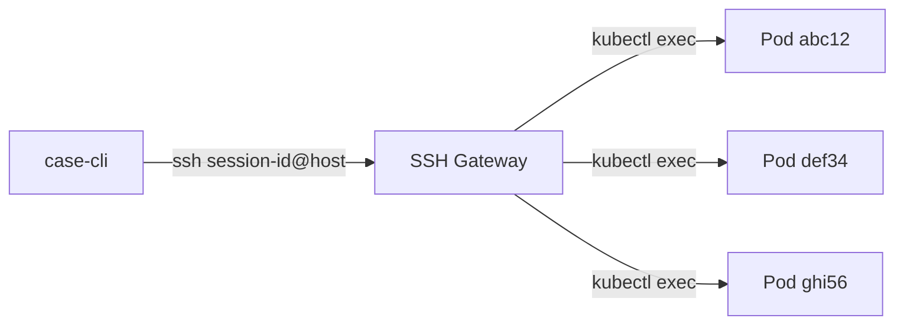
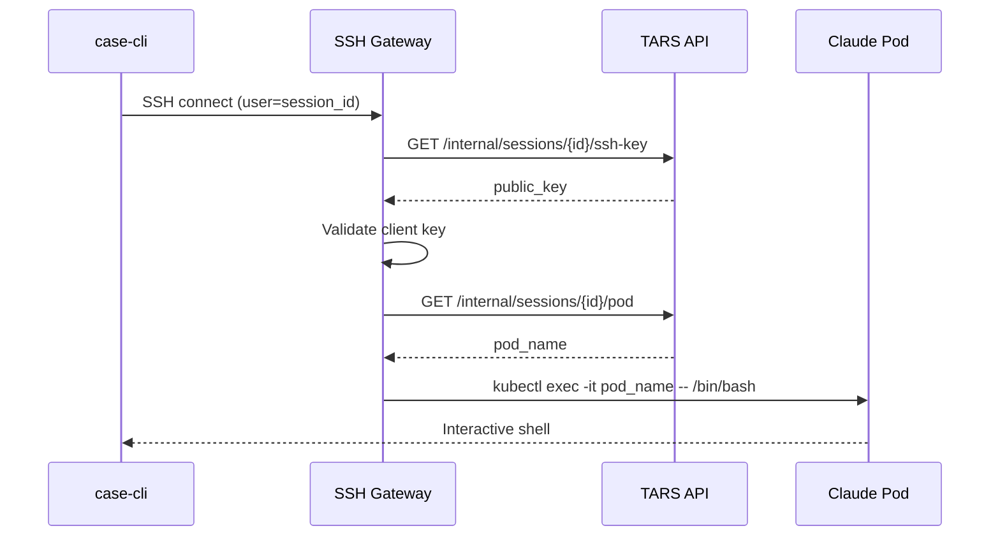

# SSH Gateway for Multi-Pod SSH Routing

## Problem

Currently, SSH connections to `tars-claude-ssh.services.tooling.cloudwalk.network` cannot be routed to a specific pod because TCP (unlike HTTP) has no path-based routing. The current Istio VirtualService only matches on port, causing random load balancing.

## Solution

Create an SSH Gateway that:

1. Receives all SSH connections on a single endpoint
2. Uses the **username** as the session/pod identifier
3. Routes to the correct pod via `kubectl exec`



## Architecture



## Implementation

### 1. Create SSH Gateway App

Create new directory structure at `apps/ssh-gateway/`:

```
apps/ssh-gateway/
├── Dockerfile
├── README.md
├── config/
│   └── sshd_config
└── scripts/
    ├── entrypoint.sh
    ├── lookup-key.sh
    └── route-session.sh
```

**Key files:**

- `Dockerfile`: Ubuntu base with OpenSSH + kubectl
- `scripts/route-session.sh`: ForceCommand script that extracts session_id from username and runs `kubectl exec`
- `scripts/lookup-key.sh`: AuthorizedKeysCommand script that fetches public key from TARS API
- `config/sshd_config`: OpenSSH config with ForceCommand and AuthorizedKeysCommand

### 2. Add Internal API Endpoints

Add to [app/routes/internal_route.py](app/routes/internal_route.py) (or create if not exists):

```python
@router.get("/internal/sessions/{session_id}/pod")
async def get_session_pod(session_id: str):
    """Get pod name for a session (used by SSH gateway)"""
    # Lookup conversation by session_id (pod_id suffix)
    # Return pod_name from metadata

@router.get("/internal/sessions/{session_id}/ssh-key")
async def get_session_ssh_key(session_id: str):
    """Get SSH public key for a session (used by SSH gateway)"""
    # Return ssh_public_key from conversation metadata
```

### 3. Store SSH Public Key in Conversation Metadata

Modify [app/services/claude_code_service.py](app/services/claude_code_service.py) to save `ssh_public_key` in conversation metadata when creating interactive sessions (line ~304):

```python
conversation.metadata = {
    "container_id": result.container_id,
    "ssh_public_key": request.ssh_public_key,  # Add this
    # ... other fields
}
```

### 4. Create Kubernetes Manifests

Create `apps/ssh-gateway/k8s/`:

- `deployment.yaml`: Gateway deployment with 2 replicas for HA
- `service.yaml`: ClusterIP service exposing port 2222
- `serviceaccount.yaml`: ServiceAccount with RBAC for pod exec
- `virtualservice.yaml`: Istio VirtualService routing TCP:2222 to gateway

**Required RBAC permissions:**

- `pods`: get, list (to find session pods)
- `pods/exec`: create (to exec into pods)

### 5. Update case-cli Connect Command

Modify [apps/case-cli/cli.py](apps/case-cli/cli.py) to use session_id as SSH username:

```python
# Current (broken):
ssh_cmd = f"ssh -p 2222 claude@{ssh_host}"

# New:
ssh_cmd = f"ssh -p 2222 {session_id}@{ssh_host}"
```

### 6. Simplify VirtualService

Update [app/utils/runtime.py](app/utils/runtime.py) `_create_interactive_virtual_service()` to remove per-pod TCP routes since all SSH traffic goes to gateway.

## File Changes Summary

| File | Action |

| ------------------------------------- | ------------------------------------------------ |

| `apps/ssh-gateway/` | Create new directory with Dockerfile and scripts |

| `apps/ssh-gateway/k8s/` | Create Kubernetes manifests |

| `app/routes/internal_route.py` | Add session lookup endpoints |

| `app/services/claude_code_service.py` | Store ssh_public_key in metadata |

| `apps/case-cli/cli.py` | Use session_id as SSH username |

| `app/utils/runtime.py` | Simplify VirtualService (remove TCP routes) |

## Testing Plan

1. Deploy SSH Gateway to cluster
2. Create a new session with `case-cli create`
3. Verify `case-cli connect` uses correct username format
4. Test SSH connection routes to correct pod
5. Test with multiple concurrent sessions
